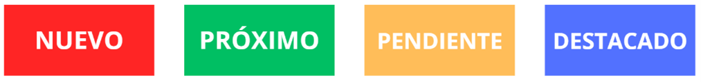
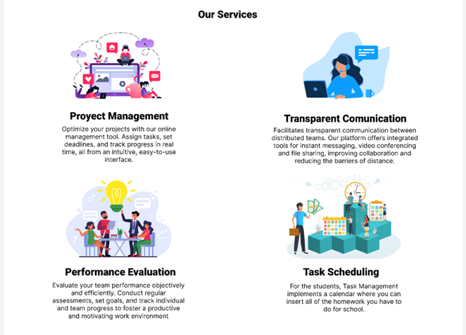
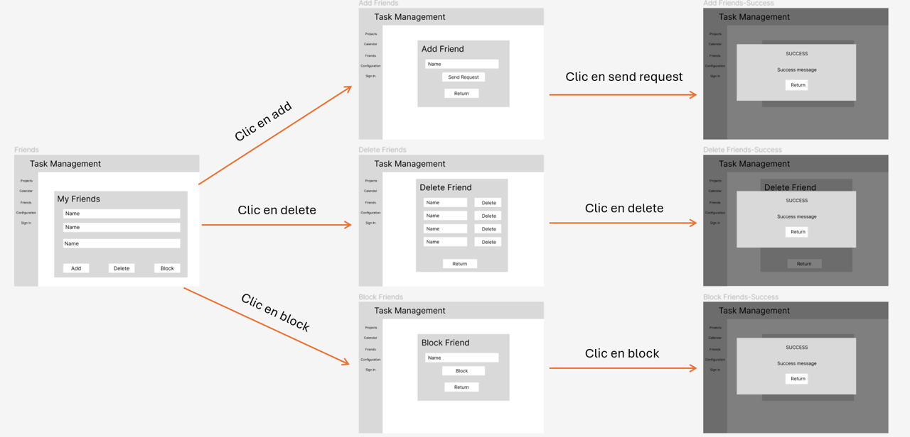
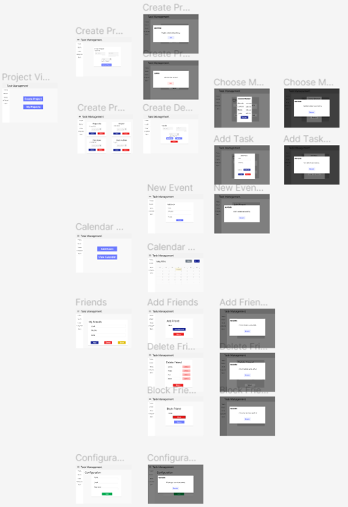
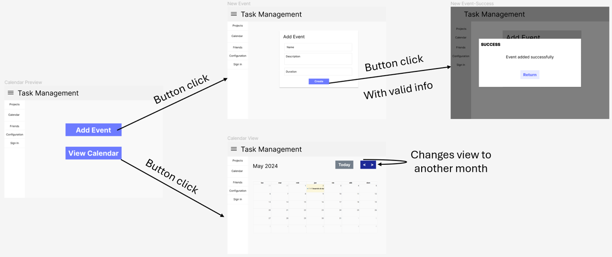

|
__FINAL REPORT__

Task Management

Team Members

Casaverde De La Cruz, Ernesto David	U20221b657

Mendoza Solis, Javier Kenyi	               U201824550

Navarro Robles, Lorenzo Sebastian	U201713141

Neyra Santa Cruz, Marcelo Sebastian	U202217241

Silva Morales, Renzo Cesar	               U20221c362

Docente: Alberto Wilmer Sanchez Seña

|
| - |
|

|

**Universidad Peruana de Ciencias Aplicadas**

**Ingeniería de Software**

**SI729 | DESARROLLO DE APLICACIONES OPEN SOURCE**

Desarrollo de Aplicaciones Open Source SI729 

Ciclo 2024-1
# CONTENT
[CAPÍTULO 1: INTRODUCCIÓN	6](#_toc165445751)

[Startup Profile	6](#_toc165445752)

[Descripción del Startup	6](#_toc165445753)

[Perfiles de integrantes del equipo	6](#_toc165445754)

[Solution Profile	8](#_toc165445755)

[Antecedentes y Problemática	8](#_toc165445756)

[Lean UX Process	11](#_toc165445757)

[Segmento Objetivo	14](#_toc165445758)

[CAPÍTULO 2: Requirements Elicitation & Analysis	15](#_toc165445759)

[Competidores	15](#_toc165445761)

[Análisis Competitivo	16](#_toc165445762)

[Estrategias y tácticas frente a competidores	18](#_toc165445763)

[Entrevistas	18](#_toc165445764)

[Diseño de Entrevistas	18](#_toc165445765)

[Registro de Entrevistas	20](#_toc165445766)

[Análisis de Entrevistas	21](#_toc165445767)

[Needfinding	22](#_toc165445768)

[User Personas	22](#_toc165445769)

[User Task Matrix	25](#_toc165445770)

[Journey Mapping	25](#_toc165445771)

[Empathy Mapping	27](#_toc165445772)

[As-Is Scenario Mapping	31](#_toc165445773)

[Ubiquitous Language	32](#_toc165445774)

[CAPÍTULO 3: REQUIREMENTS SPECIFICATION	33](#_toc165445775)

[To-be Scenario Mapping	33](#_toc165445777)

[User Stories	34](#_toc165445778)

[Impact Mapping	74](#_toc165445779)

[Product Backlog	76](#_toc165445780)

[product design	78](#_toc165445781)

[Style Guidelines	78](#_toc165445783)

[General Style Guidelines	78](#_toc165445784)

[Web Style Guidelines	80](#_toc165445785)

[Information Arquitecture	84](#_toc165445786)

[Organization Systems.	84](#_toc165445787)

[Labeling Systems	84](#_toc165445788)

[SEO Tags and Meta Tags	84](#_toc165445789)

[Searching Systems	84](#_toc165445790)

[Navigation Systems	84](#_toc165445791)

[Landing Page UI Design	85](#_toc165445792)

[Landing Page Wireframe	85](#_toc165445793)

[Landing Page Mock-up	87](#_toc165445794)

[Web Applications UX/UI Design	90](#_toc165445795)

[Web Applications Wireframes	90](#_toc165445796)

[Web Applications Wireflow Diagrams	91](#_toc165445797)

[Web Applications Mock-ups	91](#_toc165445798)

[Web Applications User Flow Diagrams	92](#_toc165445799)

[Web Applications Prototyping	93](#_toc165445800)

[Domain-Driven Software	94](#_toc165445801)

[Software Architecture Context Diagram	94](#_toc165445802)

[Software Architecture Container Diagrams	95](#_toc165445803)

[Software Architecture Components Diagrams	95](#_toc165445804)

[Software Object-Oriented Design	96](#_toc165445805)

[Database Design	98](#_toc165445806)

[Database Diagram	98](#_toc165445807)

[Product Implementation Validation & Deployment	99](#_toc165445808)

[Software Configuration Management	99](#_toc165445810)

[Software Development Environment Configuration	99](#_toc165445811)

[Source Code Managment	100](#_toc165445812)

[Source Code Style Guide & Conventions	102](#_toc165445813)

[Software Deployment Configuration	104](#_toc165445814)

[Landing Page, Services & Applications Implementation	107](#_toc165445815)

[Sprint 1	107](#_toc165445816)

[Anexos	112](#_toc165445817)

[Bibliografía	113](#_toc165445818)

**Registro de Versiones del Informe**
**

|**Versión**|**Fecha**|**Autor**|**Descripción de modificación**|
| - | - | - | - |
|**TB1**|**12/04/2024**|
Casaverde De La Cruz, Ernesto David

Mendoza Solis, Javier Kenyi

Navarro Robles, Lorenzo Sebastian

Neyra Santa Cruz, Marcelo Sebastian

Silva Morales, Renzo Cesar

|**Capítulo I Capítulo II Capítulo III Capítulo IV Capítulo V**|
|**TP**|**1/05/2024**|
Casaverde De La Cruz, Ernesto David

Mendoza Solis, Javier Kenyi

Navarro Robles, Lorenzo Sebastian

Neyra Santa Cruz, Marcelo Sebastian

Silva Morales, Renzo Cesar
|**Capítulo I Capítulo II Capítulo III Capítulo IV Capítulo V**|

**Student Outcome**

|Criterio Específico|Acciones Realizadas|Conclusiones|
| - | - | - |
|Comunica oralmente sus ideas y/o resultados con objetividad a público de diferentes especialidades y niveles jerárquicos, en el marco del desarrollo de un proyecto en ingeniería.|
**TB1:**

**Casaverde De La Cruz, Ernesto David**

Sprint 1

Entrevistas

**Mendoza Solis, Javier Kenyi**

Entrevistas

**Navarro Robles, Lorenzo Sebastian**

Entrevistas

**Neyra Santa Cruz, Marcelo Sebastian**

Entrevistas

**Silva Morales, Renzo Cesar**

Entrevistas
|
**TB1:**

Desarrollamos las entrevistas necesarias para la validación de la idea de nuestro proyecto.

**TP:**

Hemos desarrollado un video explicando el desarrollo progresivo del proyecto
|
|Comunica en forma escrita ideas y/o resultados con objetividad a público de diferentes especialidades y niveles jerárquicos, en el marco del desarrollo de un proyecto en ingeniería.|
**TB1:**

**Casaverde De La Cruz, Ernesto David**

Sprint 1

Class Diagram

Class Dictionary

**Navarro Robles, Lorenzo Sebastian**

Software Architecture diagrams

Landing Page Implementation

Landing Page Wireframes

**Neyra Santa Cruz, Marcelo Sebastian**

Start Up Profile

Solution Profile

Diseño de Entrevistas

User Stories

Product Backlog

Impact Mapping

Domain Driven Design

Diseño de la presentación PPT

Diseño del logo

**Silva Morales, Renzo Cesar**

Database Design

Database Diagram
|
**TB1:**

Hemos desarrollado todo el primer paso para mostrar por primera vez nuestra Start Up y nuestra solución de Software. Desarrollamos todos los puntos necesarios, desde la descripción de la start up hasta los primeros mock-ups de la aplicación web que se piensa entregar al usuario final.

**TP:**

Desplegamos la primera versión de nuestra web site, aplicando todos los conocimientos adquiridos en clase. También, se realizaron cambios desde la entrega pasada para la entrega de un mejor producto.

|

# CAPÍTULO 1: INTRODUCCIÓN

1. ## Startup Profile
En esta primera sección, se mostrará una descripción detallada que incluye información sobre la idea y modelo de negocio, el mercado objetivo, los competidores, el equipo fundador, estado actual y planes futuros. Nuestro objetivo es destacar los puntos fuertes de nuestro startup y nuestro potencial de crecimiento, con el fin de obtener apoyo, financiamiento o colaboraciones que impulsen su desarrollo.
1. ### Descripción del Startup
En esta sección se mostrará una breve descripción de nuestro startup, junto a nuestra misión y visión. 

Task Management es un startup liderado por estudiantes de la Universidad Peruana de Ciencias Aplicadas (UPC), pertenecientes a las carreras de Ingeniería de Software. Esta incipiente empresa se especializa en el desarrollo de software y soluciones tecnológicas dirigidas a los estudiantes y a los equipos de teletrabajo (trabajo a distancia). Nuestro objetivo es ayudarlos a alcanzar una organización adecuada de sus tareas y proyectos y, sobre todo, cumplir a sus metas. Asimismo, seguimos un modelo de aprendizaje mutuo con nuestros clientes, para, de esa manera, poder mejorar progresivamente nuestra calidad de atención y las herramientas que les ofrecemos. Para ello, hemos diseñado una aplicación llamada Task Management, dedicada en su totalidad a lograr lo anteriormente planteado.

**Misión:** Contribuir en la gestión y organización de proyectos y tareas de los estudiantes y equipos de teletrabajo. De esta manera, podremos facilitar el proceso de desarrollo del trabajo y, consecuentemente, aumentar la eficiencia de este

**Visión:** Nuestra visión es destacar como la plataforma líder que revoluciona la gestión eficiente de proyectos y tareas en el mercado. En Task Management, nuestro propósito es garantizar la eficiencia de la organización. Buscamos obtener el reconocimiento como el proveedor soluciones innovadoras y confiables para los estudiantes y equipos de teletrabajo en toda Lima.
1. ### Perfiles de integrantes del equipo
En está sección se mostrarán a todos los integrantes del equipo, junto a una foto referencial

|01|Casaverde De La Cruz, Ernesto David|
| :-: | :-: |
||Mi nombre es Ernesto David Casaverde De La Cruz. Actualmente estudio la carrera de ingeniería de software en la universidad de Ciencias Aplicadas – UPC. Entre mis habilidades, podemos destacar el buen uso de C++, HTML, CSS, JavaScript, SQL, MongoDB, Python. En mis tiempos libres practico fútbol, también me gusta leer libros, ver películas y viajar. Me considero responsable, respetuosa y amable, con estas habilidades comprometo a terminar el proyecto de la mejor manera para aportar a la sociedad.|
|02|Mendoza Solis, Javier Kenyi|
||
Mi nombre es Javier Kenyi Mendoza Solis. Actualmente estudio la carrera de ingeniería de software en la universidad de Ciencias Aplicadas – UPC. Entre mis habilidades, podemos destacar el buen uso de C++, Python y HTML. En mis ratos libres, me sumerjo en dos de mis grandes pasiones: los videojuegos y la música. Me considero como una persona con una fascinación por el mundo de la tecnología y la creatividad. Mi viaje en la programación y el desarrollo de software me ha llevado a explorar cómo las líneas de código pueden dar vida a ideas innovadoras y soluciones prácticas. Disfruto colaborando con otros para enfrentar desafíos y encontrar soluciones innovadoras

|
|03|Navarro Robles, Lorenzo Sebastian|
||Mi nombre es Lorenzo Sebastian Navarro Robles. Actualmente estudio la carrera de ingeniería de software en la universidad de Ciencias Aplicadas – UPC. Entre mis habilidades, podemos destacar el buen uso de TypeScript, Nest.js y Spring Boot. Me considero como una persona trabajadora y perseverante. Cuento con 6 meses de experiencia laboral dentro del área financiera implementando módulos dentro de aplicaciones web backoffices utilizando Next.js, typescript y Node.js con Express. He trabajado en equipos que implementan metodologías agiles como Kanban y Agile.|
|04|Neyra Santa Cruz, Marcelo Sebastian|
||Mi nombre es Marcelo Sebastian Neyra Santa Cruz, Actualmente estudio la carrera de ingeniería de software en la universidad de Ciencias Aplicadas – UPC. Entre mis habilidades, podemos destacar el buen uso de C++ y HTML. Me considero como una persona perseverante, trabajadora y amable. Mi sueño/meta es convertirme en un desarrollador de videojuegos en la empresa Nintendo.|
|05|Silva Morales, Renzo Cesar|
||Mi nombre es Renzo Cesar Silva Morales Actualmente estudio la carrera de ingeniería de software en la universidad de Ciencias Aplicadas – UPC. Entre mis habilidades, podemos destacar el buen uso de C++ y Python.  Me considero como una persona responsable, amable y entusiasta de la tecnología. En mis tiempos libres me gusta investigar sobre las novedades del mundo de la tecnología. |

1. ## Solution Profile
   1. ### Antecedentes y Problemática
Para poder desarrollar adecuadamente nuestro caso, utilizaremos la técnica “5 W’s y 2 H’s”. La estructura de esta técnica permite tener una mayor organización y especificación de las actividades que se desarrollarán como empresa, lo que facilita la elaboración de la solución a la necesidad que se desea resolver. (Alvarez, 2020)

**El problema (What?)**

- ¿Cuál es el problema?

  La dificultad para poder organizarse en el centro de trabajo o estudio

- ¿Cuál es la relación con la persona en cuestión?

  En el entorno estudiantil, la falta de organización puede afectar considerablemente su rendimiento académico.

  En el entorno laboral, la falta de organización puede llegar a tal nivel en donde la persona puede descuidar diversos aspectos de su vida laboral o social.

**El momento (When?)**

- ¿Cuándo sucede el problema?

  El problema se genera cuando las personas empiezan a tener una mayor cantidad de trabajos pendientes. 

- ¿Cuándo utiliza el cliente el producto?

  El cliente utilizará nuestro producto cuando necesite una herramienta que lo ayude a organizarse mejor.

**El lugar (Where?)**

- ¿Dónde está el cliente cuando usa el producto?

  Nuestros clientes principalmente se encontrarán ubicados en lugares de estudio o trabajo que presenten una conexión a internet estable, como en la oficina, en la escuela o su propio hogar. 

- ¿A dónde se dirige?

  Nuestros clientes se dirigen a tener una mejor organización en su vida laboral o estudiantil. Ambos quieren mejorar su rendimiento para desarrollar mejores trabajos

- ¿Dónde surge el problema?

  En ambos casos, el problema surge cuando se empieza a tener una mayor cantidad de trabajos y/o tareas. Mientras más responsabilidades se deben desarrollar, es necesario contar con una planificación más profunda y estratégica para completar correctamente todas las actividades.

**Los involucrados (Who?)**

- ¿Quiénes están involucrados?
  - Equipos de teletrabajo que no logren poder organizarse correctamente para desarrollar sus trabajos
  - Estudiantes escolares o universitarios que con problemas de gestión de tiempo para realizar sus tareas
- ¿Quién lo utilizará?

  La aplicación será utilizada por estudiantes y miembros de equipos de teletrabajo que deseen mejorar su eficiencia en su organización para desarrollar con mayor sencillez su trabajos y tareas.

- ¿A quiénes le sucede el problema?

  El problema afecta principalmente a los estudiantes y miembros de equipos de teletrabajo que necesitan presentar un trabajo o tarea pero la gran cantidad de responsabilidades le dificultan desarrollarla correctamente.

**La razón (Why?)**

**Segmento: Equipo de Teletrabajo**

La aparición de la pandemia del COVID-19 ha tenido un impacto significativo en el uso del teletrabajo, un esquema de trabajo donde el empleado realiza sus labores en un espacio fuera de las instalaciones de trabajo y, por lo tanto, no tiene interacciones físicas con sus colegas o jefes (Santillán, 2020). Aunque esta modalidad de trabajo ya existía desde los años 90, fue a raíz de la pandemia que la mayoría de las empresas empezaron a utilizarlo, incluso si no contaban con los recursos necesarios para llevarlo como un método eficaz de trabajo (Giniger, 2020).  Aunque las herramientas ofrecidas en el teletrabajo están diseñadas para facilitar los procesos de trabajo, existen una gran cantidad de personas que no logran adaptarse a estos nuevos métodos. Desarrollar las labores en un entorno no diseñado para el trabajo, como, por ejemplo, el hogar, puede traerle a la persona una gran cantidad de distracciones que puede llegar a causar estrés, como las obligaciones o la carga familiar (Pérez, 2010, como se citó en Bazurto y Macías, 2021). Estos problemas, además de generar estrés, dificultan la organización de la realización de trabajos. Además, debido a la falta de supervisión de un jefe o administrador, este método de trabajo es mucho más propenso a tener problemas como la deficiente comunicación entre los trabajadores, llegar a trabajar por tiempos prologados y mezclar la vida cotidiana con la vida laboral (Pisani y Tomasina, 2022).

**Segmento: Estudiantes**

Por otro lado, la pandemia también afectó el sector educativo. Hubo un incremento considerable en el uso de aulas virtuales, espacios virtuales donde los estudiantes pueden ser educados mediante recursos ofrecidos por los docentes (Área y Adell, 2009, como se citó en De Luca, 2020). En este entorno virtual, muchas instituciones educativas intentaron continuar con los mismos métodos que utilizaban en las aulas presenciales antes de la pandemia. Aunque la idea no parecía tan mala, debido a que los métodos de aprendizaje difieren mucho en un entorno virtual desde el hogar a uno presencial en un aula de clases, la calidad de enseñanza fue deficiente en muchas ocasiones (Hurtado, 2020). Además de las poco eficientes clases, las diferentes distracciones que ocurrían en el hogar solo conllevaban a una mala experiencia académica, por lo que era necesario una buena gestión de su tiempo para el estudio. Por más que la mayoría de los alumnos en el Perú han regresado a tener una educación netamente presencial, el problema sigue persistiendo, aunque en menor medida.

**La forma (How?)**

- ¿Cómo usan mi producto?

  Nuestros clientes utilizarán nuestro software para resolver los desafíos de la gestión adecuada de tiempo. La aplicación ofrece funcionalidades con las que se puede tener una buena coordinación y eficiencia en la gestión de proyectos.

- ¿En dónde puede encontrar el cliente el producto?

  La forma en como los potenciales clientes descubrirán nuestro producto serán las siguientes: 

- Publicidad en línea
- Contenido en redes sociales
- Búsquedas en internet
- Referencias de clientes anteriores
- Recomendaciones personales

Nuestros clientes podrán acceder al contenido de la aplicación a través de nuestra aplicación web “Task Management”

**El fondo (How much?)**

**Segmento: Equipos de Teletrabajo**

En Perú, dirigir una empresa no es una tarea sencilla. IPAE Acción Empresarial reporta que una de cada cuatro medianas empresas sufre caídas del 50% en ventas debido a mala gestión (Gestión, 2016).

Hasta junio del año 2022, el Ministerio de Trabajo señaló que alrededor de unas 200,000 personas trabajaban con el método de trabajo en línea. Un estudio realizado por el Instituto San Ignacio Loyola (ISIL) en abril de 2022, con 250 principales empresas peruanas, nos muestra que el 89% ya cuenta con algún tipo de trabajo remoto, teniendo el 39% un modelo de trabajo completamente remoto.

La mayoría de estas empresas no estaba preparada para la modalidad de teletrabajo. El estudio de ISIL destaca que el 73% de las empresas carecía de políticas o estrategias para el trabajo remoto. 

El mayor desafío es la gestión de equipos. Mantener la comunicación entre áreas es difícil, principalmente con herramientas como WhatsApp, Zoom o Microsoft Teams. Entre algunos problemas adicionales, son evidentes la falta de capacitación (33%), riesgos de pérdida de información (11%) y recursos insuficientes (8%).

**Segmento: Estudiantes**

Según el diario Gestión (2024), en Perú en el año 2019, alrededor del 9% de estudiantes decidían llevar sus estudios de manera 100% virtual; mientras que, en el año 2022, este porcentaje aumentó a 50%, número la cuál fue bajando progresivamente hasta llegar a la actualidad, en donde se mantiene con un 9%.

La razón por la gran reducción del porcentaje es, además de volver a la presencialidad, debido a que los alumnos consideran que las clases presenciales son significativamente mejores que las virtuales. Según el diario El Comercio (2022), la mayoría de los alumnos destacan que es mucho más sencillo concentrarse en una sesión presencial a una virtual, ya que es más fácil organizar su tiempo para separar la hora de estudio a la de entretenimiento.

En lo que respecta a la organización del tiempo, un experimento realizado por Cabero, García y López (2020) nos muestra una interesante diferencia entre los estudiantes que no cuentan con herramientas para gestionar su tiempo, aquellos que cuentan con una (que en este caso es una barra de tareas) y aquellos que cuentan con dos (la barra de tareas y el tiempo empleado en el estudio). Se notó que los estudiantes que contaban solo con una herramienta emplearon alrededor de 50% menos tiempo que los otros dos grupos, aunque en los 3 grupos los estudiantes obtuvieron notas similares.
1. ### Lean UX Process
   1. #### *Lean Ux Problem Statements*
Para identificar los problemas que tienen nuestros clientes, hemos desarrollado 2 problem statements, uno por cada segmento objetivo. Estos tienen como objetivo aclarar los problemas principales, establecer objetivos claros y guiarnos en la toma de decisiones.

**Problem Statement 1**

Nuestra aplicación “Task Management” fue diseñada para lograr una mejor organización y coordinación en los proyectos desarrollados en línea. A través de nuestro servicio, los equipos de teletrabajo podrán crear y visualizar proyectos y tareas para tener seguimiento de los trabajos que deben realizar.

Hemos observado que muchos de nuestros clientes tienen problemas para darle seguimiento a las tareas que se realizan en el equipo. Actualmente, los usuarios están utilizando herramientas externas que les permita llevar el seguimiento de los trabajos.

¿Cómo podemos mejorar el seguimiento de tareas para que los equipos de teletrabajo tengan una mejor eficacia en el desarrollo de su trabajo?

**Problem Statement 2**

Nuestra aplicación “Task Management” fue diseñada para brindar apoyo en la gestión de tareas y asignaciones para los estudiantes. A través de nuestro servicio, los estudiantes pueden administrar las tareas utilizando un sencillo calendario que puede configurar en cualquier momento.

Hemos notado que muchos de nuestros clientes tienen problemas para recordar la presentación de las tareas que fueron agregadas al calendario. Actualmente, los usuarios están utilizando herramientas externas que les permita recordar sobre una tarea que está en el calendario.

¿Cómo podemos mejorar el calendario para que los estudiantes puedan recordar con mayor facilidad la fecha de entrega de las tareas?
1. #### *Lean UX Assumptions*
En esta sección se desarrolló las suposiciones de usuario y negocio. Estas suposiciones tienen como objetivo darnos una idea más clara de cómo podría ser y actuar nuestro cliente objetivo.

**Business Assumptions**

1. **Creo que mis clientes necesitan** conocer la manera más adecuada de organizar sus proyectos y trabajos para garantizar un buen flujo de trabajo.
1. **Estas necesidades se pueden resolver con** un sistema sencillo de utilizar que permita el seguimiento de los proyectos y tareas mediante un calendario.
1. **Mis clientes son** los estudiantes escolares y universitarios, al igual que líderes y miembros de equipos de teletrabajo que necesiten una mejor organización de su trabajo
1. **El valor N.°1 que mi cliente quiere de mi servicio es** mejorar su organización de sus tareas o proyectos y, por lo tanto, aumentar su eficiencia y productividad
1. **El cliente también puede adquirir estos beneficios adicionales mediante** un plan de suscripción mensual que permita obtener funcionalidades más especializadas y completas a lo largo del uso del servicio
1. **Voy a adquirir a la mayoría de mis clientes** mediante la difusión de anuncios en plataformas de redes sociales donde se explique nuestra oferta de solución y las ventajas en comparación con la competencia, incluyendo nuestro enfoque empresarial favorable para las personas que necesiten una mejor organización.
1. **Haré dinero a través de** publicidad que se encuentra adentro de la aplicación y, especialmente, a través del plan de suscripción mensual que los usuarios pueden optar en comprar para acceder a funcionalidades más especializadas que los ayuden a realizar un trabajo más organizado.
1. **Mi competencia principal en el mercado serán** las aplicaciones enfocadas en la calendarización de actividades y seguimiento de tareas y trabajos.
1. **Los venceremos debido a** la implementación de diversas características de aplicación de organización dentro de un mismo ambiente (Task Management application), complementándose entre sí y ofreciendo estos servicios a los estudiantes escolares y universitarios y los líderes y miembros de equipos de teletrabajo sin necesidad de que realicen una inversión inicial.
1. **Mi mayor riesgo de producto es** la posibilidad de que se presenten problemas de conexión entre los al momento de utilizar nuestra aplicación y, por lo tanto, no se envíe la información de los usuarios correctamente, afectando la experiencia de usuario.
1. **Resolveremos esto a través** del uso de servidores de iCloud Computing y Big Data, los cuales son seguros y confiables con relación a la información gestionada y la considerable cantidad que esta puede abarcar.

**User Assumptions**

1. **¿Quién es el usuario?** 

Los usuarios de Task Management constituyen en estudiantes escolares y universitarios y líderes y miembros de equipos de teletrabajo que buscan una solución que les permita gestionar sus tareas proyectos de manera eficiente y colaborativa.

1. **¿Dónde encaja nuestro producto, en su trabajo o vida?** 

Este producto se adapta perfectamente a la dinámica laboral para los equipos de teletrabajo y la dinámica escolar para los estudiantes escolares y universitarios que están en la búsqueda de una plataforma en línea. Esta plataforma les permite no solo administrar sus proyectos o tareas de manera efectiva, sino también mejorar significativamente la comunicación y la coordinación entre todos los miembros del equipo. Además, facilita un seguimiento preciso del progreso y una asignación de tareas altamente eficiente.

1. **¿Qué problemas tiene nuestro producto y cómo se pueden resolver?** 

Al utilizar nuestra aplicación, es posible encontrarse con ciertos inconvenientes. Entre los más importantes, podemos destacar la dependencia de contar con una conexión estable a internet y la presentación de errores al momento de cargar archivos para su envío a otro miembro del equipo. Ante estos problemas, recomendamos contar con una conexión sólida a internet, especialmente si se desea cargar rápidamente y sin problemas los archivos adjuntos, y respaldar los archivos importantes con copias de seguridad.

1. **¿Cuándo y cómo es usado nuestro producto?**

Nuestra aplicación tiene un uso diario. Sea el usuario un estudiante, un miembro o líder de equipo, Task Management puede utilizarse diariamente para asegurarse de contar con un eficiente flujo de trabajo y mantener una buena organización con los trabajos y las tareas asignadas. 

1. **¿Qué características son importantes?**

Las características clave de Task Management incluyen la integración de herramientas de seguimiento de tareas, gestión de calendarios y fechas límite y la capacidad de compartir y adjuntar archivos.

1. **¿Cómo debe verse nuestro producto y cómo debe comportarse?**

La plataforma debe tener un espacio intuitivo, contemporáneo y que pueda manejarse sencillamente sin presentarle problemas constantemente al usuario. Es imperativo que funcione sin errores y asegure una comunicación efectiva entre todos los miembros del equipo.
1. #### *Lean UX Hypothesis Statements*
En esta sección se desarrolló las declaraciones de hipótesis. Estas tienen como objetivo darnos una idea de los comportamientos y las necesidades que pueden tener nuestros usuarios 

**Creemos que** permitir al usuario visualizar todas las tareas o trabajos que tiene pendiente ayudará a la organización del desarrollo de estos

**Sabremos que** tendremos éxito 

**Cuando** el porcentaje de uso de la opción “Visualizar Barra de Progreso de Tareas” aumente en un 30%

**Creemos que** mostrar ocasionalmente las notificaciones y recordatorios mantendrán informado al usuario acerca de las actividades que debe realizar

**Sabremos que** hemos tenido éxito.

**Cuando** más del 70% usuarios utilicen la opción de “calendarización de actividades” y se sientan seguros de que la herramienta cumple eficazmente su labor y logran realizar sus deberes a tiempo.

**Creemos que** ofrecer actualizaciones constantes que incluyan nuevas funcionalidades y entornos mantendrá nuestra aplicación relevante en el mercado peruano 

**Sabremos que** hemos tenido éxito

**Cuando** nuestro producto ocupe un 20% del mercado nacional.

1. #### *Lean UX Canvas*
En esta sección se desarrolló el Lean-UX Canvas. Este tiene como objetivo validar la hipótesis sobre nuestro servicio de manera rápida y eficiente.

|**Lean UX Canvas**|**Task Management**|**20/03/2024**||
| - | - | - | :- |
|
**BUSINESS PROBLEM**

**LA SITUACIÓN:** 

Ofrecemos un apoyo de gestión a los estudiantes y equipos de teletrabajo

**LOS PROBLEMAS COMUNES:** 

Falta de herramientas para las reuniones virtuales 

Calendario de tareas ineficiente 

**LAS PREGUNTAS:** 

¿Qué podemos ayudar a nuestro cliente para que pueda satisfacer sus necesidades?
|
**SOLUTION IDEAS**

- Ofrecer un asistente virtual que indique cómo funciona la aplicación

- Las plantillas y diseños se adecuan al cliente, según su preferencia

- Incrementar el ancho de banda del servidor para mejorar el rendimiento de la app

- Mejorar el algoritmo y capacidad del servidor para que soporte más personas
|
**BUSINESS OUTCOME**

- Mejorar periódicamente el software para ofrecer una mejor experiencia al usuario

- Ayudar a los equipos de teletrabajo a ser más productivos y eficientes

- Alcanzar mejores reseñas de los usuarios
||
|
**Usuario y clientes**

- Líder de equipo de teletrabajo que necesite ayuda en la gestión de su equipo de teletrabajo asignado

- Miembro de equipo de teletrabajo que actualmente esté insatisfecho con la comunicación con su equipo

- Estudiantes escolares o universitarios que con problemas de gestión de tiempo para realizar sus tareas
||||
|
**Hipótesis**

**Creemos que** implementar funcionalidades diseñadas para fomentar la organización será la clave del éxito de nuestra aplicación en la gestión y organización de un equipo de teletrabajo.

**Sabremos que hemos tenido éxito.**

**Cuando** las ventas de nuestro plan de suscripción aumenten en un 50%
|
**¿Cuál es la cosa más importante que debemos aprender primero?**

- Las personas están dispuestas a realizar cambios si es que estos los beneficiará

- Cualquier actualización a la aplicación **NO** debe perjudicar la accesibilidad del usuario
|
**¿Cuánto es la mínima cantidad de trabajo que debemos hacer para aprender lo siguiente más importante?**

- Entrevistar a los miembros y líderes de equipo de teletrabajo de distintas empresas para comprender sus necesidades

- Hacer un análisis de mercado para conocer a nuestra competencia

- Analizar la cantidad de estudiantes escolares y universitarios que presentan problemas con la presentación de tareas
||

1. ## Segmento Objetivo
En esta sección se muestran los segmentos objetivos. Estos tienen como objetivo mostrar el grupo más probable de clientes que tienen necesidades, características demográficas, comportamientos o intereses similares que los hacen más receptivos a la oferta de nuestra empresa.

- **EQUIPOS DE TELETRABAJO:** Conformados por un líder y varios miembros, dispersos geográficamente y que necesiten una herramienta para coordinar, colaborar y hacer un seguimiento del progreso del proyecto de manera efectiva.
- **ESTUDIANTES:** Escolares y universitarios que presenten problemas con la organización para realizar sus tareas.

# CAPÍTULO 2: REQUIREMENTS ELICITATION & ANALYSIS

   1. ## Competidores
Basándonos en un análisis de mercado, hemos reconocimos a nuestros principales competidores:

**Trello**

Es una plataforma en línea para gestionar proyectos que emplea tarjetas para organizar y priorizar tareas. Cada tarjeta representa una tarea o proyecto y se puede colocar en listas que representan etapas del proceso como "pendiente", "en proceso" o "completado". Las tarjetas admiten descripciones, archivos, comentarios y fechas límite.

**Miro**

Se trata de un programa de colaboración en línea empleado para generar y compartir diagramas, mapas conceptuales, presentaciones, modelos de productos y otras cosas más. Conocido anteriormente como "RealtimeBoard", Miro posibilita la colaboración en tiempo real entre equipos en un entorno de trabajo digital, sin importar dónde se encuentren geográficamente.

**Basecamp**

Es una herramienta en línea para la gestión de proyectos que fomenta la colaboración y la eficiencia. Permite a los equipos crear proyectos y tareas, compartir archivos, mantener conversaciones y realizar un seguimiento del avance

1. ### Análisis Competitivo
En esta sección se desarrolló el análisis competitivo. Este tiene como objetivo identificar las ventajas y desventajas que tenemos frente a los competidores principales.

<table><tr><th colspan="6">Competitive Analysis Landscape</th></tr>
<tr><td colspan="2" valign="top">¿Por qué llevan a cabo este análisis?</td><td colspan="4" valign="top">El análisis lo llevamos a cabo para comparar nuestra idea de solución con otras existentes. De esta manera, podremos identificar nuestras fortalezas, debilidades, oportunidades y amenazas en relación con el mercado actual</td></tr>
<tr><td colspan="2">Empresas</td><td>Task Management</td><td>Miro</td><td>Trello</td><td>Basecamp</td></tr>
<tr><td rowspan="2">Perfil</td><td valign="top">Overview</td><td valign="top">Plataforma de gestión de tareas y proyectos dirigida a los equipos de teletrabajo y estudiantes. Ofrece herramientas como calendario o barra de progreso para la eficiente organización</td><td valign="top">Plataforma de colaboración en línea con pizarra digital donde los usuarios pueden crear, compartir y colaborar en tiempo real</td><td valign="top">Herramienta de gestión de proyectos en línea que utiliza un enfoque visual para la organización de tareas y proyectos</td><td valign="top">Herramienta en línea que ayuda a los equipos a administrar y organizar sus tareas y proyectos, proporcionando un espacio para compartir información.</td></tr>
<tr><td valign="top">Ventaja Competitiva ¿Qué valor ofrece a los clientes?</td><td valign="top">Entorno de trabajo colaborativo con las herramientas necesarias para la organización</td><td valign="top">Canvas intuitivo para generar presentaciones, ideas y diagramas</td><td valign="top">Tarjetas visuales que permiten visualizar y gestionar las actividades</td><td valign="top">Espacio de trabajo único y completo</td></tr>
<tr><td rowspan="2">Perfil de Marketing</td><td valign="top">Mercado Objetivo</td><td valign="top">Miembros y líderes de equipo de teletrabajo y estudiantes escolares y universitarios con problemas de organización</td><td valign="top">Usuarios que necesitan de una plataforma para estructurar y plasmar su conocimiento</td><td valign="top">Equipos de gran tamaño que necesitan de una aplicación para la organización de sus proyectos y tareas</td><td valign="top">Organizaciones y empresas que buscan soluciones para simplificar su trabajo remoto.</td></tr>
<tr><td valign="top">Estrategias de Marketing</td><td valign="top">Marketing digital, primordialmente redes sociales</td><td valign="top">Redes sociales y pruebas con potenciales clientes</td><td colspan="2" valign="top">Evaluación de habilidades y experiencia por parte de profesionales del mismo campo</td></tr>
<tr><td rowspan="3">Perfil de Producto</td><td valign="top">Productos y Servicios</td><td valign="top">Herramientas de comunicación, colaboración y planificación que les permita a los usuarios tener un mejor flujo de trabajo y organización</td><td valign="top">Herramientas populares, como plantillas personalizables y cambio de apariencia según las necesidades del usuario</td><td valign="top">Gran variedad de planes y opciones que satisfacen las necesidades de los equipos de trabajo, especialmente los más grandes</td><td valign="top">Diferentes planes que ofrecen almacenamiento de datos, más proyectos y diversas características extra, como chat en tiempo real</td></tr>
<tr><td valign="top">Precios y Costos</td><td valign="top">
- Plan gratuito con características básicas

- Plan de pago por $7 mensual con características, como chat IA y almacenamiento extra

- Plan empresarial personalizado
</td><td valign="top">
- Plan gratuito con características básicas

- Planes de pago desde $8 mensuales que ofrecen funciones como aumentar el almacenamiento

-Plan empresarial personalizado
</td><td valign="top">
- Plan gratuito con características básicas

- Planes de pago que incluyen más funciones y almacenamiento.
</td><td valign="top">
- Plan gratuito con características básicas

-Plan de negocios que ofrece más funciones y almacenamiento para equipos de hasta 100 usuarios

- Plan empresarial personalizado
</td></tr>
<tr><td valign="top">Canales de Distribución </td><td>Web</td><td colspan="3">Web y Móvil</td></tr>
<tr><td rowspan="5">Análisis FODA</td><td colspan="5" valign="top">Para tener éxito, siempre es necesario identificar las fortalezas y oportunidades, al igual que las posibles debilidades y amenazas del mercado.</td></tr>
<tr><td valign="top">Fortalezas</td><td valign="top">La herramienta es sencilla de entender, incluso para estudiantes escolares sin experiencia previa. Es escalable para equipos de cualquier tamaño y proyecto.</td><td valign="top">La herramienta puede adaptarse a equipos de cualquier tamaño y, sin importar la complejidad de proyecto que se está desarrollando</td><td valign="top">La herramienta tiene una interfaz gráfica que es sencilla de navegar y utilizar. También, ofrece una amplia gama de funciones, como la comunicación en línea</td><td valign="top">La herramienta tiene una interfaz de usuario fácil de usar y navegar, al igual que una gran cantidad de funciones. Además, está disponible para dispositivos móviles y computadoras personales</td></tr>
<tr><td valign="top">Debilidades</td><td valign="top">Para el buen funcionamiento de la aplicación, es necesario contar con dispositivos de media o alta gama</td><td valign="top">Algunas características tienen una curva alta de aprendizaje que pueden desmotivar al usuario en aprender su uso</td><td valign="top">
No cuenta con una función de seguimiento de tareas.

No es adecuada para proyectos complejos
</td><td valign="top">No es adecuada para proyectos complejos, ya que carece de funciones importantes para proyectos de gran escala </td></tr>
<tr><td valign="top">
Oportu_

nidades
</td><td valign="top">Las nuevas tecnologías nos permiten desarrollar nuevas funcionalidades para la mejor experiencia de usuario.</td><td valign="top">El desarrollo de nueva tecnología permite que se agreguen nuevas e innovadoras funcionalidades</td><td valign="top">Las empresas deben implementar nuevos métodos y tecnologías a su software para mantenerse en el mercado</td><td valign="top">Las nuevas herramientas nos permiten abrirnos a nuevos mercados.</td></tr>
<tr><td valign="top">Amenazas</td><td valign="top">Ser una incipiente empresa implica que los clientes desconocen de tu marca, lo que hace que sea más complicado vender tu solución de software</td><td valign="top">La industria tecnológica presenta siempre nuevos competidores, por lo que debemos estar siempre ofreciendo nuevas razones para atraer más clientes y retener a los actuales</td><td valign="top">El desafío más grande de una empresa tecnológica independiente son los nuevos competidores y la falta de relación con Google</td><td valign="top">Los desafíos más grandes son los nuevos competidores, la falta de recursos y la alta competitividad de la competencia</td></tr>
</table>

1. ### Estrategias y tácticas frente a competidores
En esta sección se identificaron las estrategias y tácticas frente a los competidores. Estas tienen como objetivo diferenciarnos de los competidores para que nuestro producto sea más exitoso.

Nuestras estrategias incluyen la diferenciación mediante características únicas; cómo la competencia en costos; nuestro software será cómodo y accesible para nuestro segmento objetivo, la mejora de la estrategia de marketing; principalmente promocionarnos por las redes sociales, la innovación constante por medio de los comentarios, y la mejora del servicio al cliente.
1. ## Entrevistas
Siguiendo la perspectiva de Easwaramoorthy y Zarinpoush (2006), las entrevistas representan una estrategia de investigación que implica el intercambio de diálogo con el propósito de adquirir datos, empleando cuestionamientos específicos para explorar en profundidad el pensamiento y la visión de la persona objeto de estudio.
1. ### Diseño de Entrevistas
Para conocer si nuestra propuesta es adecuada para nuestro segmento objetivo hemos desarrollado unas cuantas preguntas para las entrevistas y conocer cómo podríamos mejorar nuestra propuesta para el cliente.

**Segmento: Equipos de Teletrabajo**

Líderes de equipo de teletrabajo que enfrentan problemas para organizar a su equipo eficientemente

Preguntas de las entrevistas:

- Cuéntame un poco sobre ti, ¿Cuál es tu cargo laboral?
- En términos generales, ¿Cómo funciona su empresa?
- ¿Cuáles son tus metas?
- ¿Qué dispositivos tecnológicos, aplicaciones o marcas son los que más usas dentro de tu trabajo?
- ¿Cuáles son los problemas más importantes en su trabajo?
- Hemos notado que su empresa cuenta con la posibilidad de trabajar de manera remota, ¿Cómo funciona exactamente?
- ¿Utiliza actualmente un software para gestionar su(s) equipo(s) remoto(s)?
- ¿Tiene frecuentemente problemas de organización en sus equipos remotos, incluso con el software de gestión?
- ¿Puede, normalmente, solucionar este problema en los equipos?
- ¿Cree que una nueva herramienta que le permita organizar y gestionar sus equipos de teletrabajo sencillamente le sería de ayuda?

Trabajadores en equipos de teletrabajo que enfrentan problemas de organización y desempeño laboral que requieren soluciones efectivas.

Preguntas de las entrevistas:

- Cuéntame un poco sobre ti, ¿Cuál es tu cargo laboral?
- En términos generales ¿De qué trata la empresa en la que trabaja?
- ¿Cómo funciona exactamente el trabajo remoto en su empresa?
- ¿Qué dispositivos tecnológicos son los que más usas dentro de tu trabajo?
- ¿Considera que la dificultad y experiencia laboral en el trabajo remoto es similar a la del presencial?
- ¿Tiene frecuentemente problemas de organización al trabajar remotamente?
- ¿Puede, normalmente, solucionar estos problemas?
- ¿Al trabajar remotamente es constantemente monitoreado su avance de trabajo?
- ¿Su empresa utiliza un sistema o programa para gestionar el avance de su trabajo? De ser así, ¿Cómo funciona?
- ¿Cree que una nueva herramienta que le permita organizar y gestionar su trabajo sencillamente le sería de ayuda?

**Segmento: Estudiantes**

Estudiantes escolares y universitarios que presenten problemas con la organización para realizar sus tareas.

Preguntas de las entrevistas

- Cuéntame un poco sobre ti, ¿En qué grado/ciclo académico estás?
- Académicamente hablando, ¿Te va bien en el colegio/universidad?
- ¿Tienes o intentas seguir normalmente un horario dedicado al estudio?
- ¿Cuentas con espacio acondicionado para estudiar?
- ¿Utilizas algún método de estudio?
- ¿Utilizas alguna herramienta para gestionar tus trabajos pendientes, como una agenda?
- ¿Qué tan frecuente te ocurre que te olvides de completar una tarea?
- ¿Te sientes o alguna vez te has sentido abrumado por la cantidad de trabajos y tareas que debes realizar? ¿Por qué?
- ¿Usted realiza actividades no relacionadas con el estudio, como practicar deporte o trabajar? De ser así, ¿Considera que estas actividades le quitan tiempo para realizar sus deberes académicos?
- ¿Crees que tu rendimiento académico mejoraría si contaras con una aplicación donde puedas gestionar tus tareas pendientes y organizar tus trabajos?

1. ### Registro de Entrevistas
En esta sección se mostrarán las evidencias de las entrevistas de las entrevistas desarrolladas. Cada entrevista presenta una descripción breve de la persona encuestada, al igual que una síntesis del video de esta.

Enlace del video de las entrevistas: <https://upcedupe-my.sharepoint.com/:v:/g/personal/u202217241_upc_edu_pe/EXbVI-L-53NPl81CMhUPmNUBhmHFQgrvMeC_86EJw6ZRtA?e=9VDkut>

**Entrevista N°1: Cynthia Vargas**

- Sexo: Femenino
- Edad: 39
- Residencia: Surco
- Momento en que inicia la entrevista: 0:02
- Duración: 4:24

Cynthia Vargas, una economista que trabaja en HMY Perú como jefe de oficina técnica de proyectos, se encarga de la administración de los equipos remotos de trabajo. Uno de los mayores problemas que se presentan es la capacidad de los empleados de aprovecharse del mal sistema para no realizar su trabajo

**Entrevista N°2: Shirley Alva**

- Sexo: femenino
- Edad: 17
- Momento en que inicia la entrevista: 0:10
- Duración: 2:58

Shirley Alva, una estudiante de último año de secundaria que reside en Perú, menciona que esfuerza por mantener una rutina de estudio, disponiendo de un espacio dedicado en su habitación para evitar distracciones y además utiliza diferentes métodos de estudio según el tipo de materia. Para recordar sus compromisos, emplea tanto una agenda física como recordatorios en su celular, aunque admite que a veces olvida algunas tareas cuando está bajo presión o con muchas responsabilidades acumuladas. Por lo que considera que una aplicación de gestión de tareas con un valor agregado sería de gran ayuda para organizar mejor su tiempo y compromisos, lo cual podría contribuir a mejorar su desempeño académico.

**Entrevista N°3: Gregoria Sinche**

- Sexo: femenino
- Edad: 54
- Momento en que inicia la entrevista: 0:06
- Duración: 3:03

Gregoria Sinche, una florista con más de 30 años de experiencia en la industria, trabaja en un emprendimiento especializado en la creación y distribución de arreglos florales para eventos. Su objetivo es mantener un servicio de alta calidad y mejorar la eficiencia para ser más competitivos. En el lugar donde trabajan utilizan la herramienta Trello para la gestión equipos, sin embargo, menciona que a veces experimentan problemas de saturación y organización, especialmente durante períodos de alta demanda. Por ello, ella considera que una aplicación de gestión del tiempo sin tantos inconvenientes sería beneficiosa para mejorar la eficiencia de su trabajo y así le permita disfrutar de más tiempo libre sin sacrificar la calidad del servicio.

**Entrevista N°4: Katy Ramírez**

- Sexo: femenino
- Edad: 22
- Momento en que inicia la entrevista: 0:13
- Duración: 3:22

Katy Ramírez nos menciona que se esfuerza por mantener un horario de estudio, dedicando tiempo específico para clases y actividades no relacionadas con ello como el deporte, el cual ella considera que es fundamental para su bienestar general. 

Como estudiante universitaria menciona que tiende a veces olvidar sus deberes por lo que una aplicación de gestión de tareas y tiempo le vendría de maravilla para así poder mejorar su rendimiento académico 

**Entrevista N°5: Fabian Reyes**

- Sexo: Masculino
- Edad: 19
- Momento en que inicia la entrevista: 0:06
- Duración: 4.50

**Entrevista N°6: Franccesco Nevada**

- Sexo: Masculino
- Edad: 16
- Momento en que inica la entrevista: 0:20
- Duración: 4:20

Franccesco Nevada es un estudiante que está cursando el 5to de secundaria. Nos cuenta que, en general, siempre le ha ido bien en sus estudios y que no suele tener problemas en su organización. Sin embargo, en semanas donde pueden dejar varias actividades o tareas, puede llegar a tener una experiencia abrumadora.

1. ### Análisis de Entrevistas
Las entrevistas realizadas revelaron los diferentes puntos de vista de las personas sobre el trabajo a distancia. Entre los principales problemas, podemos destacar:

**Asignación de tareas fuera del horario de trabajo**

La falta de una persona (o grupo de personas) que administre el trabajo realizado por los empleados permite que ocurran situaciones como esta. Algunos de los entrevistados suelen recibir llamadas, mensajes, correos o encargos fuera de su horario de trabajo, por lo que no están en obligación de responder o realizar el trabajo pedido. No obstante, en numerosas ocasiones, sí lo realizan. Las razones por las que lo hacen difieren entre persona y persona. Sin embargo, en general, la razón principal es que se sienten obligados a responder para quedar bien con su jefe.

**Aprovecharse de las limitaciones del programa de gestión**

Una gran cantidad de programas de gestión actuales cuentan con diversas formas en las que el usuario, sea trabajador, administrador o jefe de equipo, puede aprovecharse de sus funcionalidades. Uno de los problemas más frecuentes, mencionados por los entrevistados, es la facilidad con la que un trabajador puede utilizar el sistema para aparentar trabajar. Por ejemplo, un empleado puede establecer una cantidad de tiempo exagerada en la planilla para un trabajo bastante sencillo.

**Falta de comunicación con los clientes**

Las aplicaciones que utilizan las empresas para contactarse con los clientes no siempre son de lo más fiables. Existen ocasiones en las que, por ejemplo, los servidores están en mantenimiento o cuentan con algún error, lo que impide la comunicación entre el empleado y el cliente. Este tipo de situaciones son bastante perjudiciales, tanto para el cliente como para el empleado, ya que el primero no obtiene la información correctamente, por lo que puede perder el interés en la conversación y podría considerar la situación como algo recurrente, por lo que dudaría sobre la fiabilidad de la empresa; mientras que el segundo podría perder a un potencial cliente (o al cliente recurrente)
1. ## Needfinding
En las siguientes secciones se desarrolló todo el proceso del needfinding. El objetivo principal del needfinding es obtener una comprensión profunda y empática de los usuarios para informar el diseño de productos, servicios o experiencias que satisfagan sus necesidades de manera efectiva.
1. ### User Personas
Utilizaremos user personas para representar de manera ficticia y detallada a nuestros clientes

**SEGMENTO OBJETIVO: EQUIPO DE TELETRABAJO**

**Jefe de equipo de teletrabajo: Renzo Quispe Palomino**

**Miembro de equipo de Teletrabajo: Cielo Rodriguez Calderon**

**SEGMENTO OBJETIVO: ESTUDIANTES**

**Estudiante escolar o universitario: Maria Pérez de la Cruz** 
1. ### User Task Matrix
Utilizaremos el user task matrix para organizar y priorizar las tareas que los usuarios deben poder realizar dentro de nuestro servicio.

<table><tr><th rowspan="2">Task Matrix</th><th>Renzo Quispe Palomino</th><th colspan="2" valign="top">Cielo Rodriguez Calderon</th><th colspan="4" valign="top">Maria Pérez de la Cruz</th></tr>
<tr><td>Frecuencia</td><td>Importancia</td><td colspan="2">Frecuencia</td><td>Importancia</td><td>Frecuencia</td><td>Importancia</td></tr>
<tr><td valign="top">Crear Tareas</td><td>Siempre</td><td>Alta</td><td colspan="2">Siempre</td><td>Alta</td><td>Siempre</td><td>Alta</td></tr>
<tr><td valign="top">Establecer eventos o tareas en el calendario</td><td>A veces</td><td>Media</td><td colspan="2">Raramente</td><td>Baja</td><td>Siempre</td><td>Muy alta</td></tr>
<tr><td valign="top">Establecer fechas límites de entregas de tareas</td><td>Siempre</td><td>Alta</td><td colspan="2">A veces</td><td>Media</td><td>Siempre</td><td>Alta</td></tr>
<tr><td valign="top">Hacer un seguimiento de una tarea o proyecto</td><td>A veces</td><td>Alta</td><td colspan="2">A veces</td><td>Alta</td><td>Siempre</td><td>Alta</td></tr>
<tr><td valign="top">Establecer la importancia de una tarea</td><td>A veces</td><td>Media</td><td colspan="2">A veces</td><td>Media</td><td>A veces</td><td>Alta</td></tr>
<tr><td valign="top">Marcar como cumplida las tareas</td><td>A veces</td><td>Media</td><td colspan="2">A veces</td><td>Alta</td><td>Siempre</td><td>Muy alta</td></tr>
<tr><td valign="top">Aplazar la fecha límite de la tarea</td><td>A veces</td><td>Media</td><td colspan="2">Raramente</td><td>Baja</td><td>A veces</td><td>Media</td></tr>
<tr><td valign="top">Crear Proyecto</td><td>A veces</td><td>Muy Alta</td><td colspan="2">Nunca</td><td>Ninguna</td><td>Nunca</td><td>Ninguna</td></tr>
<tr><td valign="top">Editar Detalles de Proyecto</td><td>A veces</td><td>Alta</td><td colspan="2">Nunca</td><td>Ninguna</td><td>Nunca</td><td>Ninguna</td></tr>
<tr><td valign="top">Añadir miembros a un proyecto</td><td>A veces</td><td>Muy alta</td><td colspan="2">Nunca</td><td>Ninguna</td><td>Nunca</td><td>Ninguna</td></tr>
<tr><td valign="top">Visualizar Integrantes de una tarea asignada al proyecto</td><td>A veces</td><td>Alta</td><td colspan="2">Nunca</td><td>Ninguna</td><td>Nunca</td><td>Ninguna</td></tr>
</table>

1. ### Journey Mapping
La herramienta del journey mapping la utilizamos para visualizar y comprender la experiencia completa de un usuario al interactuar con nuestro servicio a lo largo del tiempo.

**Renzo Quispe Palomino**

**Cielo Ramirez Calderon**

**Maria Pérez de la Cruz**

1. ### Empathy Mapping
El Empathy Mapping lo desarrollamos para profundizar en la comprensión de los usuarios para poder diseñar experiencias que se ajusten mejor a sus necesidades y deseos.

**Renzo Quispe Palomino**

**Cielo Ramirez Calderon**

**Maria Pérez de la Cruz**

1. ### As-Is Scenario Mapping
Los cuadros del As-Is Scenario Mapping los desarrollamos para verificar cómo es que es la situación actual con nuestros clientes y cómo podríamos mejorarla.

Enlace de cuadros realizados en Miro:

<https://miro.com/app/board/uXjVKWGn0ak=/?share_link_id=871702257753> 

**Renzo Quispe Palomino**

**Cielo Ramirez Calderon**

**Maria Pérez de la Cruz**

1. ## Ubiquitous Language
En esta sección se incluirán términos comúnmente utilizados alrededor de todo el desarrollo del proyecto para eliminar ambigüedades:

GLOSARIO:

**TEAM (Equipo):** Grupo conformado por personas que trabajan en un mismo proyecto. Contiene solo un “Team Leader” y de uno a muchos “Team Member”

**TEAM LEADER (Líder de equipo):** Representante de un “Team”. Tiene como objetivo gestionar el trabajo realizado por los “Team Member”

**TEAM MEMBER (Miembro de equipo):** Miembro de un “Team”. Tiene como objetivo completar los trabajos y las tareas indicadas por el “Team Leader”

**PROJECT (Proyecto de trabajo):** Entorno de trabajo que el “Team Leader” y los “Team Member” utilizan para completar un proyecto propuesto. Los “Proyect” hacen uso de los objetos “Assigment”, “Progress Bar”, “Event”, “Calendar” y “Notification”

**STUDENT (Estudiante):** Persona que actualmente se encuentra estudiando en un colegio o universidad. Tiene como objetivo completar las tareas que se encuentran en el calendario.

**ASSIGMENT (Tarea):** Asignación asociada a un “Project” que el “Team Leader” le da a uno o más “Team Member”. Un “Assigment” debe ser completado en un intervalo de tiempo especificado por el “Team Leader”. Un “Assigment”

**PROGESS BAR (Barra de progreso de tareas):** Indicador visual que muestra la cantidad de “Assigment” completadas y “Assigment” pendientes

**EVENT (Evento):** Un “Event” es un horario designado en el “Calendar” para realizar alguna actividad, sea relacionada con un “Proyect” o no. Por ejemplo, un “Event” puede ser “Reunión con los ‘Team Member’”.

**CALENDAR (Calendario):** Un “Calendar” es un calendario que incluye visualmente las fechas de entrega de los “Assigment” y las fechas donde ocurren los “Event”

**NOTIFICATION (Notificación):** Indicador visual que muestra un mensaje en el lado superior de la pantalla por un corto lapso.

**DEADLINE (Fecha de entrega):** Un “Deadline” indica cuándo un “Assigment” debe ser entregado.

# CAPÍTULO 3: REQUIREMENTS SPECIFICATION

   1. ## To-be Scenario Mapping
Los cuadros del To-Be Scenario Mapping los desarrollamos para indicar cómo es que la experiencia de los usuarios mejorará cuando utilicen nuestra aplicación web.

Enlace de cuadros realizados en Miro:

<https://miro.com/app/board/uXjVKWGn0ak=/?share_link_id=871702257753> 

**Renzo Quispe Palomino**

**Cielo Ramirez Calderon**

**Maria Pérez de la Cruz**

1. ## User Stories
Las Historias de Usuario se desarrollaron con el fin de explicar las funcionalidades y características del producto final.

La escala de "Story Points" utilizada es la Escala de Fibonacci (1, 2, 3, 5, 8).

Nota: Las historias de usuario están marcadas como “USXX”, mientras que las historias técnicas están marcadas como “TSXX”, siendo XX números enteros positivos.

|**Epic / Story ID**|**Título**|**Descripción**|**Criterios de Aceptación**|**Relacionado con (EPIC ID)**|
| :-: | :-: | :-: | :-: | :-: |
|
**EPIC 0: LANDING PAGE**

Como usuario

Quiero contar con una landing page

Para visualizar todas las funcionalidades que tiene la aplicación web que ofrece la empresa
|||||
|EP0 / US01|Implementación de Barra de navegación|
Como visitante

Quiero tener la opción de atravesar todas las secciones de la landing page a través de una barra de navegación

Para facilitar el acceso a la información

|
**Escenario 1: Traslado de una sección a otra**

Dado que el usuario se encuentra en la landing page

Cuando el usuario seleccione una de las secciones de la barra de navegación

Entonces se trasladará a la sección seleccionada

**Escenario 2: Selección de la misma sección de la landing page**

Dado que el usuario se encuentra en una sección específica de la landing page

Cuando el usuario seleccione la misma sección en la barra de navegación

Entonces la pantalla no se moverá a otra sección diferente
|0|
|EP0 / US02|Logo y Descripción de la empresa|
Como visitante

Quiero visualizar el logo y descripción de la empresa

Para verificar que estoy en la landing page oficial de la empresa

|
**Escenario 1: Visualización del Logo**

Dado que el usuario se encuentra en la landing page

Cuando el usuario seleccione “Inicio” en la barra de navegación

Entonces se trasladará al usuario a la sección del logo y descripción de la empresa

**Escenario 2: El logo no aparece**

Dado que el usuario se encuentra en la landing page

Cuando el usuario seleccione “Inicio” en la barra de navegación

Y el logo de la empresa no haya cargado

Entonces se trasladará al usuario a la sección del logo y descripción de la empresa

Y aparecerá solo la descripción
|0|
|EP0 / US03|Detalles y Servicios de la empresa|
Como visitante

Quiero visualizar los detalles y servicios de la empresa

Para conocer de qué manera se puede utilizar la aplicación
|
**Escenario 1: Traslado a la sección servicios**

Dado que el usuario se encuentra en la landing page

Cuando el usuario seleccione “Servicios” en la barra de navegación

Entonces se trasladará al usuario a la sección de detalles de servicios

**Escenario 2: El usuario ya se encuentra en la sección servicios**

Dado que el usuario se encuentra en la sección “servicios”

Cuando el usuario seleccione “Servicios” en la barra de navegación

Entonces el sistema mantendrá al usuario en la sección seleccionada

|0|
|EP0 / US04|Clientes de la empresa|
Como visitante

Quiero visualizar las experiencias de clientes previos de la empresa

Para es que la vida de los usuarios cambió al utilizar la aplicación
|
**Escenario 1: Traslado a la sección clientes**

Dado que el usuario se encuentra en la landing page

Cuando el usuario seleccione “Clientes” en la barra de navegación

Entonces se trasladará al usuario a la sección de experiencia de clientes

**Escenario 2: El usuario ya se encuentra en la sección clientes**

Dado que el usuario se encuentra en la sección “clientes”

Cuando el usuario seleccione “Clientes” en la barra de navegación

Entonces el sistema mantendrá al usuario en la sección seleccionada
|0|
|EP0 / US05|Acerca de nosotros|
Como visitante

Quiero visualizar la misión y visión de la empresa

Para conocer qué planes tienen a futuro
|
**Escenario 1: Traslado a la sección Nosotros**

Dado que el usuario se encuentra en la landing page

Cuando el usuario seleccione “Acerca de Nosotros” en la barra de navegación

Entonces se trasladará al usuario a la sección de experiencia de clientes

**Escenario 2: El usuario ya se encuentra en la sección nosotros**

Dado que el usuario se encuentra en la sección “Nosotros”

Cuando el usuario seleccione “Acerca de Nosotros” en la barra de navegación

Entonces el sistema mantendrá al usuario en la sección seleccionada
|0|
|EP0 / US06|Implementación de un Footer|
Como visitante

Quiero visualizar un Footer al final de la página

Para ver las redes sociales asociadas a la empresa
|
**Escenario 1: Traslado a la sección de footer**

Dado que el usuario se encuentra en la landing page

Cuando el usuario se dirija al final de la landing page

Entonces el usuario visualizará las redes sociales asociadas a la empresa

**Escenario 2: Traslado al usuario de la red social seleccionada**

Dado que el usuario se encuentra en el footer

Cuando el usuario seleccione una de íconos de las redes sociales que aparecen la sección del footer

Entonces el sistema redirigirá al usuario a la red social indicada
|0|
|EP0 / US07|Simulación de registro|
Como visitante

Quiero visualizar cómo sería registrarme en la aplicación

Para que verificar qué información me piden
|
**Escenario 1: Traslado a la sección de Registro**

Dado que el usuario se encuentra en la landing page

Cuando el usuario seleccione “Registrarme” en la barra de navegación

Entonces se refirige al usuario al entorno “Registro”

**Escenario 2: Simulación de Registro Exitoso**

Dado que el usuario se encuentra en el entorno “Registro”

Cuando el usuario ingrese todos sus datos correctamente

Y acepta los términos y condiciones

Entonces se redirige al usuario a la página principal

**Escenario 3: Simulación con edad inválida**

Dado que el usuario se encuentra en el entorno “Registro”

Cuando el usuario ingrese una edad inválida

Y ingrese todos sus datos

Y acepta los términos y condiciones

Entonces aparecerá un mensaje de error, indicando que debe ingresar una edad válida

**Escenario 4: Simulación con correo electrónico inválido**

Dado que el usuario se encuentra en el entorno “Registro”

Cuando el usuario ingrese un correo electrónico inválido

Y el usuario ingrese todos sus datos

Y acepta los términos y condiciones

Entonces aparecerá un mensaje de error, indicando que debe ingresar un correo electrónico válido

**Escenario 5: Simulación con contraseñas que no coinciden**

Dado que el usuario se encuentra en el entorno “Registro”

Cuando el usuario ingrese un correo electrónico inválido

Y el usuario ingrese todos sus datos

Y las contraseñas ingresadas no coinciden

Y acepta los términos y condiciones

Entonces aparecerá un mensaje de error, indicando que las contraseñas no coinciden

**Escenario 5: Simulación sin aceptar los términos y condiciones**

Dado que el usuario se encuentra en el entorno “Registro”

Cuando el usuario todos sus datos correctamente

Y no acepta los términos y condiciones

Entonces aparecerá un mensaje de error, indicando que debe aceptar los términos y condiciones
|0|
|EP0 / US08|Simulación de inicio sesión|
Como visitante

Quiero visualizar cómo sería iniciar sesión en la aplicación

Para ver si es que funcionaría rápida y correctamente
|
**Escenario 1: Traslado a la sección de Inicio Sesión**

Dado que el usuario se encuentra en la landing page

Cuando el usuario seleccione “Iniciar Sesión” en la barra de navegación

Entonces se refirige al usuario al entorno “Inicio Sesión”

**Escenario 2: Simulación de Inicio Sesión Exitoso**

Dado que el usuario se encuentra en el entorno “Inicio Sesión”

Cuando el usuario ingrese todos sus datos correctamente

Entonces se redirige al usuario a la página principal

**Escenario 3: Simulación con correo electrónico inválido**

Dado que el usuario se encuentra en el entorno “Inicio Sesión”

Cuando el usuario ingrese un correo electrónico inválido

Entonces aparecerá un mensaje de error, indicando que debe ingresar un correo electrónico válido
|0|
|EP1 / TS01|Traslado a un entorno diferente|
Como desarrollador

Quiero que el usuario pueda trasladarse libremente entre todos los entornos de la landing page

Para que el usuario pueda ver todo lo que la aplicación ofrece
|
**Escenario 1: Traslado exitoso**

Dado que el ENDPOINT/usuario está disponible

Cuando una solicitud GET sea enviada al presionar uno de los botones de redirección, que pueden ser “Registrarme” o “Iniciar Sesión”

Entonces se recibe una respuesta con el estado 200

Y el mensaje “Traslado Exitoso” es mostrado

Y se redirige al usuario al entorno seleccionado

**Escenario 2: Error del servidor**

Dado que el ENDPOINT/usuario está disponible

Cuando una solicitud GET sea enviada al presionar uno de los botones de redirección, que pueden ser “Registrarme” o “Iniciar Sesión”

Y el servidor tenga algún problema al retribuir la información de la página seleccionada

Entonces se recibe una respuesta con el estado 500

Y el mensaje “ERROR EN EL SERVIDOR” es mostrado
|0|
|
**EPIC 1: REGISTRO DE USUARIOS**

Como usuario

Quiero poder registrarme e iniciar sesión

Para acceder a todas las herramientas que Task Management me ofrece
|||||
|EP1 / US01|Registro de usuario|
Como usuario de cualquiera de los segmentos objetivos sin una cuenta en el sistema

Quiero poder registrarme en la aplicación

Para acceder a todas sus funcionalidades
|
**Escenario 1: Ingreso a la página “Crear una cuenta”**

Dado que el usuario se encuentra en la página “Inicio Sesión”

Cuando el usuario seleccione el botón “Crear nueva cuenta”

Entonces se redirige al usuario a la página “Crear nueva cuenta”

**Escenario 2: Registro exitoso**

Dado que el usuario se encuentra en la página “Crear nueva cuenta”

Cuando el usuario ingrese sus datos de registro (nombre, dirección de correo electrónico, contraseña)

Entonces el sistema crea una nueva cuenta, incluyendo los datos de registro proporcionados por el usuario

Y se redirige al usuario a la página principal

**Escenario 3: Registro con datos incompletos**

Dado que el usuario se encuentra en la página “Crear nueva cuenta”

Cuando el usuario intente registrar una cuenta sin proporcionar todos los datos de registro requeridos (nombre, dirección de correo electrónico, contraseña)

Entonces se muestra un mensaje de error, indicando que no puede crearse una cuenta sin haber completado todos los campos

**Escenario 4: Registro con correo electrónico ya registrado**

Dado que el usuario se encuentra en la página “Crear nueva cuenta”

Cuando el usuario ingrese una dirección de correo electrónico ya está registrada en el sistema

Entonces se muestra un mensaje de error, indicando que la dirección de correo electrónico ya está en uso

**Escenario 5: Registro con un nombre inválido**

Dado que el usuario se encuentra en la página “Inicio Sesión”

Cuando el usuario ingrese un nombre inválido

Entonces se muestra un mensaje de error, indicando que el nombre escrito no puede ser utilizado para crear una cuenta
|1|
|EP1 / US02|Acceso de usuario|
Como usuario de cualquiera de los segmentos objetivos con una cuenta existente

Quiero poder iniciar sesión en la aplicación utilizando mi dirección de correo electrónico y contraseña 

Para acceder a mi cuenta y utilizar todas las funcionalidades de la aplicación
|
**Escenario 1: Inicio de sesión exitoso**

Dado que el usuario se encuentra en la página “Inicio Sesión”

Cuando el usuario ingrese una dirección de correo electrónico que tenga una cuenta registrada en el sistema

Y el usuario ingrese la contraseña asociada al correo electrónico proporcionado

Entonces se redirige al usuario a la página principal de la aplicación

**Escenario 2: Inicio de sesión con un correo electrónico no registrado en el sistema**

Dado que el usuario se encuentra en la página “Inicio Sesión”

Cuando el usuario ingrese una dirección de correo electrónico que no tenga una cuenta registrada en el sistema

Entonces se muestra un mensaje de error, indicando que el correo o contraseña es incorrecto

**Escenario 3: Inicio de sesión con una contraseña inválida**

Dado que el usuario se encuentra en la página “Inicio Sesión”

Cuando el usuario ingrese una dirección de correo electrónico

Y una contraseña inválida

Entonces se muestra un mensaje de 1error, indicando que el correo o contraseña es incorrecto

**Escenario 4: Inicio de sesión con una cuenta desactivada**

Dado que el usuario se encuentra en la página de “Inicio Sesión”

Cuando el usuario intente iniciar sesión con una cuenta desactivada

Entonces el sistema activa automáticamente la cuenta

Entonces se redirige al usuario a la página principal de la aplicación
|1|
|EP1 / US03|Recuperación de Contraseña|
Como usuario de cualquiera de los segmentos objetivos, 

Quiero tener la capacidad de restablecer mi contraseña en caso de olvidarla, 

Para así poder acceder nuevamente a mi cuenta
|
**Escenario 1: Ingreso al entorno “Recuperar Contraseña”**

Dado que el usuario se encuentra en la página “Inicio sesión”

Cuando el usuario dé clic en "Olvidé mi contraseña"

Entonces se redirige al usuario al entorno “Recuperar Contraseña”

**Escenario 2: Recuperación con dirección de correo electrónico válido**

Dado que el usuario se encuentra en el entorno “Recuperar Contraseña”

Cuando el usuario escriba una dirección de correo electrónico registrada en el sistema

Entonces se muestra el entorno “Nueva Contraseña”

**Escenario 3: Recuperación con dirección de correo electrónico inválido**

Dado que el usuario se encuentra en el entorno “Recuperar Contraseña”

Cuando el usuario proporcione una dirección de correo electrónico que no se encuentra actualmente registrada en el sistema

Entonces se muestra un mensaje de error, indicando que la dirección de correo electrónico no está registrada en el sistema

**Escenario 4: Restablecimiento de contraseña exitoso** 

Dado que el usuario se encuentra en la página “Nueva Contraseña”

Cuando el usuario ingresa una nueva contraseña

Entonces se muestra un mensaje de confirmación, indicando que la contraseña se ha restablecido correctamente

Y se redirige al usuario a la página “Inicio Sesión”

**Escenario 5: Restablecimiento de contraseña con la misma contraseña que la original**

Dado que el usuario se encuentra en la página “Recuperar Contraseña”

Cuando el usuario ingresa una contraseña igual a la que actualmente está utilizando

Entonces se muestra un mensaje de error, indicando que no puede cambiarse a la misma contraseña que está actualmente en uso

|1|
|EP1 / TS01|Registrar Usuario|
Como desarrollador

Quiero agregar usuarios a la base de datos

Para que puedan utilizar mi aplicación

|
**Escenario 1: Registro de usuario exitoso**

Dado que el ENDPOINT/usuario está disponible

Cuando una solicitud POST sea enviada con los datos de nombre, edad, sexo, correo electrónico, contraseña

Entonces se recibe una respuesta con el status 201

Y un recurso de usuario es incluido en el campo de respuestas con un nuevo ID y los datos ofrecidos por el usuario

**Escenario 2: Registro con correo electrónico ya registrado**

Dado que el ENDPOINT/usuario está disponible

Cuando una solicitud POST sea enviada con los datos de nombre, edad, sexo, correo electrónico, contraseña

Y la dirección de correo electrónico ingresada ya está registrada en el sistema

Entonces se recibe una respuesta con el status 400

Y un mensaje con el valor “Correo ya registrado” es mostrado

**Escenario 3: Registro con datos incompletos**

Dado que el ENDPOINT/usuario está disponible

Cuando una solicitud POST sea enviada con solo algunos de los datos de nombre, edad, sexo, correo electrónico, contraseña

Entonces se recibe una respuesta con el status 400

Y un mensaje con el valor “Faltan datos” es mostrado

**Escenario 4: Registro con un nombre de usuario prohibido**

Dado que el ENDPOINT/usuario está disponible

Cuando una solicitud POST sea enviada con los datos de nombre, edad, sexo, correo electrónico, contraseña

Y el dato nombre sea una palabra inválida

Entonces se recibe una respuesta con el status 400

Y un mensaje con el valor “Nombre Prohibido” es mostrado

**Escenario 5: Registro con una edad inválida**

Dado que el ENDPOINT/usuario está disponible

Cuando una solicitud POST sea enviada con los datos de nombre, edad, sexo, correo electrónico, contraseña

Y el dato edad menor o igual a 0 o mayor que 130

Entonces se recibe una respuesta con el status 400

Y un mensaje con el valor “La edad no es número entero positivo menor a 130” es mostrado

**Escenario 6: Registro con una contraseña débil**

Dado que el ENDPOINT/usuario está disponible

Cuando una solicitud POST sea enviada con los datos de nombre, edad, sexo, correo electrónico, contraseña

Y la contraseña sea muy débil (sin al menos una letra mayúscula, una letra minúscula, un número y un carácter especial)

Entonces se recibe una respuesta con el status 400

Y un mensaje con el valor de “La contraseña no incluye al menos una letra mayúscula, una letra minúscula, un número y un carácter especial” es mostrado
|1|
|EP1 / TS02|Acceder Usuarios|
Como desarrollador

Quiero poder permitir el acceso a los usuarios a la aplicación web

Para que puedan utilizar los servicios ofrecidos por nuestra empresa
|
**Escenario 1: Inicio de sesión exitoso**

Dado que el ENDPOINT/usuario está disponible

Cuando una solicitud POST sea enviada con los datos válidos de dirección de correo electrónico y contraseña

Entonces se recibe una respuesta con el status 202

Y el sistema permite el acceso al usuario a la página principal

**Escenario 2: Inicio de sesión con correo electrónico inválido**

Dado que el ENDPOINT/usuario está disponible

Cuando una solicitud POST sea enviada con los datos de dirección de correo electrónico y contraseña

Y la dirección de correo electrónico no esté guardada en el servidor

Entonces se recibe una respuesta con el status 404

Y un mensaje con el valor de “No existe una cuenta asociada a el correo electrónico proporcionado” es mostrado

**Escenario 3: Inicio de sesión con contraseña incorrecta**

Dado que el ENDPOINT/usuario está disponible

Cuando una solicitud POST sea enviada con los datos de dirección de correo electrónico y contraseña

Y la contraseña sea incorrecta

Entonces se recibe una respuesta con el status 400

Y un mensaje con el valor “Datos incorrectos” es mostrado

**Escenario 4: Inicio de sesión con datos incompletos**

Dado que el ENDPOINT/usuario está disponible

Cuando una solicitud POST sea enviada con solo uno de los datos de dirección de correo electrónico y contraseña

Entonces se recibe una respuesta con el status 400

Y un mensaje con el valor “Faltan Datos” es mostrado

|1|
|EP1 / TS03|Recuperar Contraseña|
Como desarrollador

Quiero que el sistema permita a los usuarios recuperar su contraseña

Para permitir que los usuarios tengan un método para acceder de nuevo a la aplicación si es que se han olvidado de su contraseña
|
**Escenario 1: Recuperación con dirección de correo electrónico válido**

Dado que el ENDPOINT/usuario está disponible

Cuando una solicitud POST sea enviada con el dato de dirección de correo electrónico

Y el dato ingresado esté registrado en el sistema

Entonces se recibe una respuesta con el status 202

Y el sistema permite el acceso al usuario al entorno “Nueva Contraseña”

**Escenario 2: Recuperación con dirección de correo electrónico inválido**

Dado que el ENDPOINT/usuario está disponible

Cuando una solicitud POST sea enviada con el dato de dirección de correo electrónico

Y el dato ingresado no esté registrado en el sistema

Entonces se recibe una respuesta con el status 401

Y un mensaje con el valor “El correo electrónico es incorrecto” es mostrado

**Escenario 4: Restablecimiento de contraseña exitoso** 

Dado que el ENDPOINT/usuario está disponible

Cuando una solicitud POST sea enviada con el dato de una nueva contraseña

Entonces se recibe una respuesta con el status 202

Y el sistema redirige al usuario a la página principal

**Escenario 5: Restablecimiento de contraseña con la misma contraseña que la original**

Dado que el ENDPOINT/usuario está disponible

Cuando una solicitud POST sea enviada con el dato de una contraseña

Y la contraseña sea la misma que la contraseña actual

Entonces se recibe una respuesta con el status 406

Y un mensaje con el valor “La nueva contraseña coincide con la actual” es mostrado

**Escenario 6: Restablecimiento de contraseña sin proporcionar una contraseña**

Dado que el ENDPOINT/usuario está disponible

Cuando una solicitud POST sea enviada sin datos

Entonces se recibe una respuesta con el status 400

Y un mensaje con el valor “Contraseña no proporcionada” es mostrado

|1|
|
**EPIC 2: MANEJO DE CUENTAS DE USUARIO**

Como usuario

Quiero poder registrarme e iniciar sesión

Para acceder a todas las herramientas que Task Management me ofrece
|||||
|EP2 / US01|Eliminación de cuenta|
Como usuario de cualquiera de los segmentos objetivos, 

Quiero poder eliminar mi cuenta 

Para asegurarme que ningún tipo de información personal se quede en la aplicación cuando desee dejar de utilizarla
|
**Escenario 1: Ingreso al entorno “Eliminar Cuenta”**

Dado que el usuario se encuentra en la página de “Configuración”

Cuando el usuario dé clic en “Eliminar Cuenta”

Entonces se redirige al usuario al entorno “Eliminar Cuenta”

**Escenario 2: Eliminación de Cuenta**

Dado que el usuario se encuentra en el entorno “Eliminar Cuenta”

Cuando el usuario seleccione el botón “Eliminar Cuenta”

Entonces se muestra la ventana “Eliminación Definitiva de Cuenta”, indicando que la acción no podrá ser deshecha

**Escenario 3: Confirmación de Eliminación de Cuenta**

Dado que el usuario se encuentra en la ventana “Eliminación Definitiva de Cuenta”

Cuando el usuario seleccione el botón “Eliminar Definitivamente”

Entonces se muestra un mensaje de confirmación, indicando que la cuenta ha sido eliminada

Y se redirige al usuario a la Página Principal
|2|
|EP2 / US02|Desactivación Temporal de Cuenta|
Como usuario de cualquiera de los segmentos objetivos, 

Quiero poder desactivar mi cuenta temporalmente 

Para que no me llegue ningún tipo de notificación acerca de la aplicación por un tiempo determinado
|
**Escenario 1: Ingreso al entorno “Desactivar Cuenta”**

Dado que el usuario se encuentra en la página de “Configuración”

Cuando el usuario dé clic en “Desactivar Cuenta”

Entonces se redirige al usuario al entorno “Desactivar Cuenta”

**Escenario 2: Desactivación Temporal de Cuenta**

Dado que el usuario se encuentra en el entorno “Desactivar Cuenta”

Cuando el usuario seleccione el botón “Desactivar Cuenta”

Entonces se muestra un menú de opciones, indicando el tiempo que el usuario puede desactivar temporalmente su cuenta (1 día, 1 semana, 2 semanas, 1 mes)

**Escenario 3: Confirmación de Desactivación Temporal de Cuenta**

Dado que el usuario ha seleccionado uno de los intervalos de tiempo de desactivación de cuenta

Cuando el usuario seleccione el botón “Desactivar”

Entonces se muestra un mensaje de confirmación, indicando que la cuenta ha sido desactivada y que puede volver a ser activada si entra de nuevo a la aplicación en cualquier momento

Y se redirige al usuario a la Página Principal
|2|
|EP2 / TS01|Eliminar Cuenta|
Como desarrollador

Quiero permitir al usuario eliminar su cuenta definitivamente mediante un solo entorno

Para que sea sencillo administrar la eliminación de las cuentas
|
**Escenario 1: Eliminación de Cuenta**

Dado que el ENDPOINT/usuario está disponible

Cuando una solicitud POST sea enviada al presionar el botón “ELIMINAR CUENTA”

Entonces se recibe una respuesta con el status 200

Y el mensaje “Se inició el proceso de eliminación de cuenta” será mostrado

Y el sistema redirige al usuario al entorno de eliminación definitiva de cuenta

**Escenario 2: Confirmación de Eliminación de Cuenta**

Dado que el ENDPOINT/usuario está disponible

Cuando una solicitud DELETE sea enviada al presionar el botón “ELIMINAR DEFINITVAMENTE”

Entonces se recibe una respuesta con el status 200

Y el mensaje “CUENTA ELIMINADA” es mostrado

Y el sistema redirige al usuario a la Página Principal
|2|
|EP2 / TS02|Desactivar cuenta|
Como desarrollador

Quiero permitir al usuario desactivar temporalmente su cuenta mediante un solo entorno

Para que sea sencillo administrar la desactivación de cuentas
|
**Escenario 1: Desactivación Temporal de Cuenta**

Dado que el ENDPOINT/usuario está disponible

Cuando una solicitud POST sea enviada al presionar el botón “Desactivar Cuenta”

Entonces se recibe una respuesta con el status 200

Y el mensaje “Desactivación de cuenta iniciada” es mostrado

Y el sistema muestra un menú de opciones, indicando el tiempo que el usuario puede desactivar temporalmente su cuenta (1 día, 1 semana, 2 semanas, 1 mes)

**Escenario 2: Confirmación de Desactivación Temporal de Cuenta**

Dado que el ENDPOINT/usuario está disponible

Cuando una solicitud PUT sea enviada al presionar el botón “Desactivar”

Entonces se recibe una respuesta con el status 200

Y el mensaje “CUENTA DESACTIVADA” es mostrado

Y el sistema desactiva la cuenta

Y el sistema redirige al usuario a la página principal
|2|
|
**EPIC 3: CREACIÓN DE PROYECTOS**

Como jefe de equipo

Quiero poder gestionar todos los proyectos a mi cargo y supervisar el trabajo de los miembros

Para conocer su progreso
|||||
|EP3 / US01|Creación de un Proyecto Nuevo|
Como usuario del segmento objetivo de equipos de teletrabajo

Quiero poder crear un nuevo proyecto en la aplicación 

Para administrar y gestionar mis labores
|
**Escenario 1: Acceder al entorno “Crear Proyecto”**

Dado que el jefe de equipo se encuentra en el entorno “Proyectos”

Cuando el jefe de equipo seleccione el botón “Crear Proyecto”

Entonces se le redirige al entorno “Crear Proyecto”

**Escenario 2: Creación de proyecto exitosa**

Dado que el jefe de equipo se encuentra en el entorno “Crear Proyecto”

Cuando el jefe de equipo ingrese los detalles del proyecto (nombre, descripción, fecha de inicio, fecha de finalización)

Y seleccione el botón "Crear"

Entonces se crea un nuevo proyecto con los detalles proporcionados

Y se muestra un mensaje de confirmación, indicando que el proyecto fue creado satisfactoriamente

**Escenario 3: Creación de proyecto con datos incompletos**

Dado que el jefe de equipo se encuentra en el entorno “Crear Proyecto”

Cuando el jefe de equipo intenta crear un proyecto sin proporcionar todos los datos requeridos

Entonces se muestra un mensaje de error, indicando que todos los campos obligatorios deben ser completados

**Escenario 4: Creación de proyecto con nombre duplicado**

Dado que el jefe de equipo se encuentra en el entorno “Crear Proyecto”

Cuando el jefe de equipo intenta crear un proyecto con un nombre que ya existe en la aplicación

Entonces se muestra un mensaje de error, indicando que ya existe un proyecto con ese nombre

**Escenario 5: Creación de proyecto con nombre inválido**

Dado que el jefe de equipo se encuentra en el entorno “Crear Proyecto”

Cuando el jefe de equipo intente crear un nuevo proyecto con un nombre inválido

Entonces se muestra un mensaje de error, indicando que el nombre es inválido

**Escenario 6: Creación de un proyecto con duración indefinida**

Dado que el jefe de equipo se encuentra en el entorno “Crear Proyecto”

Cuando el jefe de equipo intente crear un nuevo proyecto sin fecha de inicio ni fecha de límite

Entonces se creará un nuevo proyecto, indicando en la descripción que tiene “Duración Indefinida”
|3|
|EP3 / US02|Asignación de un Miembro a un Proyecto|
Como usuario del segmento objetivo de equipos de teletrabajo

Quiero poder asignar miembros a un proyecto 

Para trabajar colaborativamente en el proyecto
|
**Escenario 1: Ingreso al entorno “Detalles de Proyecto”**

Dado que el jefe de equipo se encuentra en el entorno “Proyectos”

Cuando el jefe de equipo presione un proyecto existe

Entonces se redirige al usuario al entorno “Detalles de Proyecto”

**Escenario 2: Miembros disponibles para asignar a un proyecto**

Dado que el jefe de equipo se encuentra en el entorno “Detalles de Proyecto”

Cuando el jefe de equipo presiona el botón "Asignar miembros"

Entonces se muestra la lista “Usuarios Disponibles”, indicando cada usuario que puede ser asignado al proyecto seleccionado

**Escenario 3: Asignación de miembros exitosa**

Dado que el jefe de equipo se encuentra en la lista “Usuarios Disponibles”

Cuando el jefe de equipo seleccione uno o más usuarios

Y dé clic en el botón “Agregar”

Entonces los miembros seleccionados se asignan al proyecto

Y se muestra un mensaje de confirmación, indicando que los usuarios fueron agregados al proyecto satisfactoriamente
|3|
|EP3 / US03|Gestión de Avance del Proyecto|
Como usuario de cualquiera de los segmentos objetivos, 

Quiero visualizar el avance del proyecto

Para verificar que se está desarrollando los proyectos del trabajo a una velocidad adecuada
|
**Escenario 1: Visualización del progreso del proyecto**

Dado que el usuario se encuentra en el entorno “Detalles de Proyecto”

Cuando el usuario dé clic en el botón “Progreso”

Entonces se muestra el entorno “Progreso”, indicando las tareas pendientes y el porcentaje de avance general del proyecto

**Escenario 2: Actualización del progreso del proyecto**

Dado que el usuario se encuentra en el entorno “Progreso”

Cuando el usuario realice cambios en el estado de las tareas del proyecto (marcar una tarea como completada, actualizar el porcentaje de avance)

Entonces el sistema actualiza el entorno “Progreso”, mostrando los nuevos cambios realizados

**Escenario 3: Notificaciones de progreso del proyecto**

Dado que el usuario se encuentra inscrito en un proyecto

Cuando otro usuario realice algún avance importante en el progreso del proyecto (finalización de una tarea crítica, cambio en el porcentaje de avance)

Entonces el usuario recibe una notificación, indicando que se han realizado un avance importante en el progreso del proyecto
|3|
|EP3 / TS01|Crear Proyecto|
Como desarrollador

Quiero permitir al jefe de equipo crear un proyecto 

Para que pueda colaborar con sus amigos y compañeros
|
**Escenario 1: Crear Proyecto**

Dado que el ENDPOINT/usuario está disponible

Cuando una solicitud POST sea enviada con los detalles del proyecto (nombre, descripción, fecha de inicio, fecha de finalización)

Entonces se recibe una respuesta con el status 201

Y el mensaje “Proyecto Creado” es mostrado

Y el sistema crea un proyecto

**Escenario 2: Crear proyecto con datos incompletos**

Dado que el ENDPOINT/usuario está disponible

Cuando una solicitud POST sea enviada con solo algunos de los datos requeridos

Entonces se recibe una respuesta con status 400

Y el mensaje “Datos incompletos” es mostrado

**Escenario 3: Creación de proyecto con nombre duplicado**

Dado que el ENDPOINT/usuario está disponible

Cuando una solicitud POST sea enviada con todos los detalles del proyecto

Y ya existe un proyecto con el mismo nombre

Entonces se recibe una respuesta con status 400

Y el mensaje “NOMBRE DUPLICADO” es mostrado

**Escenario 4: Creación de proyecto con nombre inválido**

Dado que el ENDPOINT/usuario está disponible

Cuando una solicitud POST sea enviada con todos los detalles del proyecto

Y el nombre es inválido

Entonces se recibe una respuesta con status 400

Y el mensaje “NOMBRE INVÁLIDO” es mostrado

**Escenario 5: Creación de un proyecto con duración indefinida**

Dado que el ENDPOINT/usuario está disponible

Cuando una solicitud POST sea enviada con todos los detalles del proyecto excepto el de la duración

Y el nombre es inválido

Entonces se recibe una respuesta con status 200

Y el mensaje “Proyecto Creado con duración indefinida” es mostrado

Y el sistema crea un proyecto con duración indefinida
|3|
|EP3 / TS02|Agregar miembros al proyecto|
Como desarrollador

Quiero permitir a los usuarios agregar a otros usuarios a un proyecto

Para que los usuarios puedan expandir su equipo de trabajo
|
**Escenario 1: Visualizar Miembros disponibles**

Dado que el ENDPOINT/usuario está disponible

Cuando una solicitud GET sea enviada al presionar botón "Asignar miembros"

Entonces se recibe una respuesta con estatus 200

Y el mensaje “Usuarios disponibles” es mostrado

Y el sistema muestra a todos los usuarios disponibles para la asignación del proyecto

**Escenario 2: Asignación de miembros exitosa**

Dado que el ENDPOINT/usuario está disponible

Cuando una solicitud PUT sea enviada al presionar el botón “Agregar”

Entonces se recibe una respuesta con el status 202

Y el mensaje “Usuarios Agregados” es mostrado

Y el sistema asigna al proyecto a los miembros seleccionados
|3|
|
**EPIC 4: CREACIÓN DE TAREAS LABORALES**

Como jefe de equipo

Quiero poder crear tareas

Para que mis miembros de equipo conozcan qué trabajo deben realizar
|||||
|EP4 / US01|Creación de tarea laboral|
Como usuario del segmento objetivo de equipos de teletrabajo

Quiero poder crear tareas 

Para asignar a los miembros de equipo el trabajo que debe completar cada uno
|
**Escenario 1: Entrada al entorno “Crear tarea”**

Dado que el jefe de equipo se encuentra en el entorno “Detalles de Proyecto”

Cuando el jefe de equipo dé clic en el botón "Crear tarea"

Entonces el sistema redirige al jefe de equipo al entorno “Crear Tarea”

**Escenario 2: Creación de tarea exitosa**

Dado que el jefe de equipo se encuentra en el entorno “Crear Tarea”

Cuando el jefe de equipo llene todos los campos obligatorios de la tarea (nombre, descripción, fecha límite)

Y hace clic en el botón de "Crear tarea"

Entonces se crea una nueva tarea con los detalles proporcionados

Y se muestra un mensaje de confirmación, indicando que la tarea fue creada satisfactoriamente

**Escenario 3: Creación de tarea con datos incompletos**

Dado que el jefe de equipo se ubica en el entorno “Crear Tarea”

Cuando el jefe de equipo intente crear una tarea sin llenar todos los campos obligatorios (nombre, descripción, fecha límite)

Entonces se muestra un mensaje de error, indicando que no puede crearse una tarea sin haber llenado todos los campos obligatorios

**Escenario 4: Creación de tarea con nombre duplicado**

Dado que el jefe de equipo se encuentra en el entorno “Crear Tarea”

Cuando el jefe de equipo intente crear una tarea con un nombre que ya existe en el proyecto

Entonces se muestra un mensaje de error, indicando que ya existe una tarea con ese nombre

**Escenario 5: Creación de tarea con un nombre inválido**

Dado que el jefe de equipo se encuentra en el entorno “Crear Tarea”

Cuando el jefe de equipo intente crear una tarea con un nombre inválido

Entonces se muestra un mensaje de error, indicando que no se puede crear una tarea con un nombre inválido
|4|
|EP4 / US02|Asignación de Responsabilidades|
Como usuario del segmento objetivo de equipos de teletrabajo

Quiero poder asignar responsables a las tareas 

Para definir el encargado de completar cada tarea del proyecto
|
**Escenario 1: Entrada al entorno “Tareas”**

Dado que el jefe de equipo se encuentra en el entorno “Detalles de Proyecto”

Cuando el jefe de equipo seleccione el botón “Tareas”

Entonces se redirige al jefe de equipo al entorno “Tareas”

**Escenario 2: Entrada al entorno “Detalles de tarea”**

Dado que el jefe de equipo está en el entorno “Tareas”

Cuando el jefe de equipo seleccione la opción de "Editar"

Entonces se redirige al jefe de equipo al entorno “Detalles de tarea”

**Escenario 3: Asignación de Responsable**

Dado que el jefe de equipo se encuentra en el entorno “Detalles de tarea”

Cuando el jefe de equipo seleccione el botón “Responsable”

Entonces aparecerá la lista “Responsable”, indicando todos los usuarios disponibles

**Escenario 4: Confirmación de Responsable**

Dado que el jefe de equipo se encuentra en la lista “Responsable”

Cuando el jefe de equipo elija un usuario como “Responsable”

Y de clic en “Confirmar”

Entonces se muestra un mensaje de confirmación, indicando que se ha asignado un responsable satisfactoriamente
|4|
|EP4 / US03|Actualización del estado de las tareas|
Como usuario de cualquiera de los segmentos objetivos

Quiero actualizar el estado de las tareas 

Para reflejar su progreso
|
**Escenario 1: Actualización del estado de tarea exitosa**

Dado que el usuario se encuentra en el entorno “Detalles de tarea”

Cuando el usuario cambia el estado de la tarea de "En progreso" a "Completada"

Entonces muestra un mensaje, indicando el estado de la tarea se ha actualizado

**Escenario 2: Actualización del estado de tarea sin permisos**

Dado que el usuario se encuentra en el entorno “Detalles de tarea” de una tarea asignada a otro usuario

Cuando el usuario intente cambiar el estado de la tarea

Entonces se muestra un mensaje, indicando que el usuario no tiene permisos para actualizar el proceso de la tarea
|4|
|EP4 / TS01|Crear Tarea Laboral|
Como desarrollador

Quiero que los jefes de equipo puedan crear tareas

Para que los miembros de equipo puedan conocer qué parte del trabajo les toca
|
**Escenario 1: Crear Tarea**

Dado que el ENDPOINT/usuario está disponible

Cuando una solicitud POST sea enviada con los detalles del proyecto (nombre, descripción, fecha límite)

Entonces se recibe una respuesta con el status 201

Y el mensaje “Tarea Creado” es mostrado

Y el sistema crea un proyecto

**Escenario 2: Crear tarea con datos incompletos**

Dado que el ENDPOINT/usuario está disponible

Cuando una solicitud POST sea enviada con solo algunos de los datos requeridos

Entonces se recibe una respuesta con status 400

Y el mensaje “Datos incompletos” es mostrado

**Escenario 3: Creación de tarea con nombre duplicado**

Dado que el ENDPOINT/usuario está disponible

Cuando una solicitud POST sea enviada con todos los detalles del proyecto

Y ya existe una tarea con el mismo nombre en el proyecto

Entonces se recibe una respuesta con status 400

Y el mensaje “NOMBRE DUPLICADO” es mostrado

**Escenario 4: Creación de tarea con nombre inválido**

Dado que el ENDPOINT/usuario está disponible

Cuando una solicitud POST sea enviada con todos los detalles de la tarea

Y el nombre es inválido

Entonces se recibe una respuesta con status 400

Y el mensaje “NOMBRE INVÁLIDO” es mostrado
|4|
|EP4 / TS02|Asignar Responsable|
Como desarrollador

Quiero el usuario pueda asignar responsables a cada una de las tareas de un proyecto

Para que puedan los usuarios conozcan qué le toca a cada uno
|
**Escenario 1: Visualizar Miembros disponibles**

Dado que el ENDPOINT/usuario está disponible

Cuando una solicitud GET sea enviada al presionar botón "Asignar miembros"

Entonces se recibe una respuesta con estatus 200

Y el mensaje “Usuarios disponibles” es mostrado

Y el sistema muestra a todos los usuarios disponibles para la asignación del proyecto

**Escenario 2: Asignación de miembros exitosa**

Dado que el ENDPOINT/usuario está disponible

Cuando una solicitud PUT sea enviada al presionar el botón “Agregar”

Entonces se recibe una respuesta con el status 202

Y el mensaje “Usuarios Agregados” es mostrado

Y el sistema asigna al proyecto a los miembros seleccionados
|4|
|
**EPIC 5: COMUNICACIÓN INTERNA**

Como miembro/jefe del equipo

Quiero poder comunicarme con cualquier miembro del grupo

Para facilitar la comunicación con mi equipo
|||||
|EP5 / US01|Comentarios en tareas y proyectos|
Como usuario de cualquiera de los segmentos objetivos

Quiero poder agregar

comentarios a las tareas y proyectos 

Para facilitar la comunicación y proporcionar actualizaciones adicionales.
|
**Escenario 1: Ingresar al entorno “Comentarios” de una tarea**

Dado que el usuario se encuentra en el entorno “Detalles de tarea” o “Detalles de Proyecto”

Cuando el usuario haga clic en el botón “Agregar Comentario”

Entonces se le redirige al entorno “Agregar Comentario” de la tarea

**Escenario 2: Agregar Comentario**

Dado que el usuario se encuentra en el entorno “Agregar Comentario”

Cuando el usuario escriba un comentario

Y el usuario dé clic en el botón de "Publicar"

Entonces se muestra el comentario en la sección “Comentarios” de la tarea o proyecto (según corresponda), junto con el nombre del usuario y la fecha de publicación del comentario

**Escenario 3: Visualizar Comentarios**

Dado que el usuario se ubica en el entorno “Detalles de tarea” o “Detalles de Proyecto”

Cuando el usuario haga clic en el botón “Ver Comentarios”

Entonces se muestran todos los comentarios anteriores en orden descendente según la fecha de publicación

Y el usuario puede visualizar el contenido de cada comentario, junto con el nombre del autor y la fecha de publicación

**Escenario 4: Eliminar Comentario**

Dado que el usuario se ubica en el entorno “Ver Comentarios”

Cuando el usuario haga clic en uno de sus comentarios

Y de clic en “Eliminar”

Entonces aparecerá un mensaje de confirmación, indicando que el mensaje fue borrado
|5|
|EP5 / US02|Notificaciones de actualizaciones en tareas y proyectos|
Como usuario de cualquiera de los segmentos objetivos

Quiero recibir notificaciones cuando haya actualizaciones en los proyectos y tareas en los que estoy involucrado 

Para conocer sobre el avance del proyecto
|
**Escenario 1: Notificación de actualización en una tarea asignada**

Dado que el usuario está asignado a una tarea

Cuando otro usuario realice una actualización en la tarea (cambio de estado, comentario)

Entonces el usuario recibe una notificación dentro de la aplicación

Y el usuario puede ingresar a la tarea desde la notificación

**Escenario 2: Notificación de actualización en un proyecto**

Dado que el usuario está asignado a un proyecto

Cuando otro usuario realiza una actualización en el proyecto (agrega tareas, comentarios)

Entonces el usuario recibe una notificación dentro de la aplicación

Y el usuario puede ingresar al proyecto desde la notificación

**Escenario 3: Entrar al entorno “Notificaciones”**

Dado que el usuario se encuentra en el entorno “Configuración”

Cuando el usuario dé clic en “Notificaciones”

Entonces se redirige al usuario al entorno “Notificaciones”

**Escenario 4: Editar Notificaciones**

Dado que el usuario se encuentra en el entorno “Notificaciones”

Cuando el usuario cambie los ajustes de preferencias de notificación (notificaciones en tiempo real, tipos de actualizaciones que deseo recibir)

Entonces el usuario solo recibirá notificaciones de la manera como se indicó
|5|
|EP5 / US03|Envío y Recibo de Mensajes|
Como usuario de cualquiera de los segmentos objetivos

Quiero poder enviar y recibir mensajes de otros miembros mi equipo 

Para facilitar la comunicación y tener un mejor flujo de trabajo
|
**Escenario 1: Ingreso al entorno “Mensajes”**

Dado que el usuario se encuentra en la página principal

Cuando el usuario presione el botón “Mensajes”

Entonces se redirige al usuario al entorno “Mensajes”

**Escenario 2: Selección de destinatario**

Dado que el usuario se encuentra en el entorno “Mensajes”

Cuando el usuario seleccione al usuario al cual quiere mandarle un mensaje

Entonces se redirige al usuario al entorno “Mensaje Directo”

**Escenario 3: Enviar mensaje a otro usuario**

Dado que el usuario se encuentra en el entorno “Mensaje Directo”

Cuando el usuario redacte un mensaje

Y el usuario de clic en el botón “Enviar”

Entonces se envía el mensaje al destinatario elegido

Y el usuario podrá ver el mensaje que acaba de enviar al final de los mensajes enviados anteriormente

**Escenario 4: Enviar mensaje vacío**

Dado que el usuario se encuentra en el entorno “Mensaje Directo”

Cuando el usuario intente enviar un mensaje vacío

Y el usuario de clic en el botón “Enviar”

Entonces se muestra un mensaje de error, indicando que no se puede enviar un mensaje vacío

**Escenario 5: Visualización de mensajes recibidos**

Dado que el usuario se encuentra en el entorno “Mensajes”

Cuando el usuario reciba un mensaje de otro usuario

Entonces se muestra al inicio de la página al chat del usuario el cual mandó el mensaje

Y se muestra el mensaje recibido, junto a la fecha y hora que se envió el mensaje
|5|
|EP5 / US04|Editar, Copiar y Borrar Mensajes|
Como usuario de cualquiera de los segmentos objetivos

Quiero poder editar, copiar y borrar mensajes que he enviado 

Para asegurarme que el contenido mandado sea el adecuado
|
**Escenario 1: Aparición del entorno “Personalización de mensaje”**

Dado que el usuario se encuentra en el entorno “Mensaje Directo”

Cuando el usuario mantenga presionado por 1 segundo un mensaje que ha enviado en el pasado

Entonces se muestra el menú de opciones “Personalización de mensaje”

**Escenario 2: Copiar un mensaje**

Dado que el usuario tiene abierto el entorno “Personalización de mensaje”

Cuando el usuario presione el botón “Copiar”

Entonces el mensaje se copiará al portapapeles del computador

**Escenario 3: Borrar un mensaje**

Dado que el usuario tiene abierto el entorno “Personalización de mensaje”

Y han pasado menos de 5 minutos desde que envió el mensaje que se quiere borrar

Cuando el usuario presione el botón “Borrar”

Entonces el mensaje enviado se borrará

Y se mostrará un pequeño texto, indicando que el mensaje fue borrado

**Escenario 4: Ingreso al entorno “Editar mensaje”**

Dado que el usuario tiene abierto el entorno “Personalización de mensaje”

Y han pasado menos de 5 minutos desde que envió el mensaje que se quiere editar

Cuando el usuario presione el botón “Editar”

Entonces se mostrará el entorno “Editar mensaje”

**Escenario 5: Editar un mensaje**

Dado que el usuario se encuentra en el entorno “Editar mensaje”

Cuando el usuario redacte un mensaje

Y de clic en el botón “Enviar”

Entonces el mensaje original cambiará al nuevo mensaje redactado

Y se mostrará un pequeño texto, indicando que el mensaje ha sido editado
|5|
|EP5 / TS01|Enviar y Recibir de Mensajes|
Como desarrollador

Quiero permitir a los usuarios enviar y recibir mensajes a otros miembros de su equipo 

Para que exista una sencilla comunicación entre ellos
|
**Escenario 1: Selección de destinatario**

Dado que el ENDPOINT/usuario está disponible

Cuando una solicitud GET sea enviada al presionar el botón con el nombre de un usuario

Entonces se recibe una respuesta con el status 200

Y el mensaje “Usuario seleccionado correctamente” es mostrado

Y el sistema selecciona al usuario con el nombre indicado

**Escenario 2: Enviar mensaje a otro usuario**

Dado que el ENDPOINT/usuario está disponible

Cuando una solicitud POST sea enviada con la información del campo “Mensaje” al presionar el botón “Enviar”

Entonces se recibe una respuesta con el status 200

Y el mensaje “Mensaje enviado” es mostrado

Y sistema envía el mensaje redactado por el usuario al destinatario elegido

**Escenario 3: Enviar mensaje vacío**

Dado que el ENDPOINT/usuario está disponible

Cuando una solicitud POST sea enviada con la información del campo “Mensaje” al presionar el botón “Enviar”

Y el campo “Mensaje” esté vacío

Entonces se recibe una respuesta con el status 400

Y el mensaje “No se puede enviar un mensaje vacío” es mostrado

**Escenario 4: Visualización de mensajes recibidos**

Dado que el ENDPOINT/usuario está disponible

Cuando una solicitud GET sea enviada al seleccionar uno de los usuarios

Entonces se recibe una respuesta con el status 200

Y el mensaje “Visualización de mensajes exitosa” es mostrado

Y el sistema muestra todos los mensajes que se han enviado entre los dos usuarios
|5|
|EP5 / TS02|Personalizar Mensajes|
Como desarrollador

Quiero permitir a los usuarios editar, copiar y borrar mensajes que han enviado 

Para que puedan manipular los datos de los mensajes que han enviado anteriormente y que exista una relación más dinámica entre los usuarios y el servidor
|
**Escenario 1: Aparición del entorno “Personalización de mensaje”**

Dado que el ENDPOINT/usuario está disponible

Cuando una solicitud GET sea enviada al mantener seleccionado por un segundo uno de los mensajes enviados

Entonces se recibe una respuesta con el status 200

Y el mensaje “Entorno Personalización de mensajes abierto” es mostrado

Y el sistema abre el entorno “Personalización de Mensaje”

**Escenario 2: Copiar un mensaje**

Dado que el ENDPOINT/usuario está disponible

Cuando una solicitud GET sea enviada al presionar el botón “Copiar”

Entonces se recibe una respuesta con el status 200

Y el mensaje “Mensaje copiado al portapapeles” es mostrado

Y el sistema copia el mensaje al portapapeles de la máquina del usuario

**Escenario 3: Borrar un mensaje**

Dado que el ENDPOINT/usuario está disponible

Cuando una solicitud DELETE sea enviada al presionar el botón “BORRAR”

Entonces se recibe una respuesta con el status 200

Y el mensaje “Mensaje borrado” es mostrado

Y el sistema borra el mensaje seleccionado

**Escenario 4: Editar un mensaje**

Dado que el ENDPOINT/usuario está disponible

Cuando una solicitud PUT sea enviada con la información escrita en el campo “Editar mensaje” al presionar el botón “EDITAR”

Entonces se recibe una respuesta con el status 200

Y el mensaje “Mensaje editado” es mostrado

Y el sistema edita el mensaje seleccionado

Y el sistema muestra debajo del mensaje editado un pequeño texto que dice “Editado”
|5|
|
**EPIC 6: CALENDARIZACIÓN**

Como usuario

Quiero tener un calendario

Para tener un seguimiento de los eventos y tareas pendientes
|||||
|EP6 / US01|Creación de eventos de calendario|
Como usuario de cualquiera de los segmentos objetivos

Quiero poder crear eventos en el calendario 

Para programar reuniones y otros eventos relevantes para seguir correctamente el proyecto
|
**Escenario 1: Ingresar al entorno “Crear Evento”**

Dado que el usuario se ubica en el entorno “Calendario”

Cuando el usuario seleccione el botón “Crear Evento”

Entonces se redirige al usuario al entorno “Crear Evento”

**Escenario 2: Crear un nuevo evento en el calendario**

Dado que el usuario se ubica en el entorno “Crear Evento”

Cuando el usuario ingrese los campos obligatorios (fecha, hora, título, descripción)

Entonces se visualizará en el calendario el evento creado

**Escenario 3: Ingresar al entorno “Editar Evento”**

Dado que el usuario se ubica en el entorno “Calendario”

Cuando el usuario dé clic en el botón “Editar Evento”

Entonces se redirige al usuario al entorno “Editar Evento”

**Escenario 4: Editar un evento existente en el calendario**

Dado que el usuario se ubica en el entorno “Editar Evento”

Cuando el usuario seleccione un evento existente en el calendario

Y el usuario cambie cualquiera de los campos obligatorios (fecha, hora, título, descripción)

Y de clic en “Guardar cambios”

Entonces los detalles del evento modificado se visualizarán en el calendario

**Escenario 5: Eliminar un evento del calendario**

Dado que el usuario se ubica en el entorno “Calendario”

Cuando el usuario seleccione un evento existente en el calendario

Y el usuario haga clic en “Eliminar Evento”

Entonces el evento ya no se mostrará en el calendario
|6|
|EP6 / US02|Recordatorios de Eventos de Calendario|
Como usuario de cualquiera de los segmentos objetivos

Quiero recibir recordatorios de eventos de calendario 

Para no olvidarme cuándo ocurren
|
**Escenario 1: Ingresar al entorno “Recordatorio”**

Dado que el usuario se ubica en el entorno “Calendario”

Cuando el usuario haga clic en “Recordatorio”

Entonces se le redirige al usuario al entorno “Recordatorio”

**Escenario 2: Configurar un recordatorio para un evento**

Dado que el usuario se ubica en el entorno “Recordatorio”

Cuando el usuario establezca un recordatorio con un intervalo de tiempo antes del evento (30 minutos, 1 hora, 12 horas, 24 horas)

Entonces el usuario recibirá una notificación o recordatorio en el momento especificado

**Escenario 3: Desactivar o eliminar un recordatorio para un evento**

Dado que el usuario se ubica en el entorno “Calendario”

Cuando el usuario seleccione un recordatorio

Y el usuario haga clic en “Eliminar”

Entonces el usuario no recibirá ninguna notificación o recordatorio para ese evento
|6|
|EP6 / US03|Visualización de tareas en el calendario|
Como usuario del segmento objetivo de estudiante, 

Quiero poder visualizar las tareas pendientes en el calendario 

Para saber cuáles son las tareas más próximas que debo completar
|
**Escenario 1: Ver tareas programadas en el calendario**

Dado que el estudiante se ubica en el entorno “Calendario”

Cuando el usuario seleccione el botón “Marcar Tareas”

Entonces los días marcados en el calendario con tareas pendientes cambiarán de color, indicando que esos días se presentan las tareas

**Escenario 2: No hay tareas programadas**

Dado que el estudiante se ubica en el entorno “Calendario”

Cuando el usuario seleccione el botón “Marcar Tareas”

Y no haya ninguna tarea en el calendario

Entonces aparecerá un mensaje, indicando que no hay tareas marcadas en el calendario
|6|
|EP6 / TS01|Crear evento de calendario|
Como desarrollador

Quiero permitir al usuario crear un evento en el calendario

Para que otros usuarios puedan visualizar los días donde se tiene un evento importante
|
**Escenario 1: Crear un nuevo evento en el calendario**

Dado que el ENDPOINT/usuario está disponible

Cuando una solicitud POST sea enviada con la información de los campos de fecha, hora, título y descripción

Entonces se recibe una respuesta con el status 201

Y el mensaje con el valor de “Evento Creado” es mostrado

Y el sistema creará un evento en el calendario en la fecha indicada

Y el sistema permitirá visualizar en el calendario el evento creado

**Escenario 2: Editar un evento existente en el calendario**

Dado que el ENDPOINT/usuario está disponible

Cuando una solicitud PUT se enviada al dar clic en “Guardar cambios”

Entonces se recibe una respuesta con el status 200

Y el mensaje con el valor de “Evento Editado” es mostrado

Y el sistema edita los detalles del evento seleccionado

Y el sistema guarda los cambios automáticamente

**Escenario 3: Eliminar un evento del calendario**

Dado que el ENDPOINT/usuario está disponible

Cuando una solicitud DELETE se enviada al dar clic en “ELIMINAR EVENTO”

Entonces se recibe una respuesta con el status 200

Y el mensaje con el valor de “EVENTO ELIMINADO” es mostrado

Y el sistema elimina el evento seleccionado

Y el sistema ya no muestra el evento borrado en el calendario
|6|
|EP6 / TS02|Crear Recordatorio de Evento de Calendario|
Como desarrollador

Quiero que el usuario cuente con un sistema de eventos de calendario

Para que no se olvide de los eventos que están por ocurrir
|
**Escenario 1: Crear un recordatorio para un evento**

Dado que ENDPOINT/ usuario está disponible

Cuando una solicitud POST sea enviada con la información del campo “Intervalo”, que puede ser 30 minutos, 1 hora, 12 horas, 24 horas, al presionar el botón “Crear”

Entonces se recibe una respuesta con el status 201

Y el mensaje con el valor de “Recordatorio creado” es mostrado

Y el sistema crea el recordatorio

**Escenario 2: Eliminar un recordatorio para un evento**

Dado que ENDPOINT/ usuario está disponible

Cuando una solicitud DELETE sea enviada al presionar el botón “Borrar recordatorio”

Entonces se recibe una respuesta con el status 200

Y el mensaje con el valor de “RECORDATORIO BORRADO” es mostrado

Y el sistema borra el recordatorio
|6|
|
**EPIC 7: SISTEMA DE ETIQUETADO**

Como miembro del equipo

Quiero tener un buscador con filtros

Para separar las tareas de los diferentes proyectos
|||||
|EP7 / US01|Etiquetado de tareas y proyectos|
Como usuario de cualquiera de los segmentos objetivos

Quiero poder etiquetar tareas y proyectos con etiquetas descriptivas 

Para una mejor organización y búsqueda
|
**Escenario 1: Etiquetar una tarea con una etiqueta descriptiva**

Dado que el usuario está ubicado en “Detalles de tarea”

Cuando el usuario seleccione el botón “Etiquetar”

Y el usuario escriba una etiqueta descriptiva (nuevo, próximo, pendiente, destacado)

Entonces el usuario puede visualizar la etiqueta asociada a la tarea

**Escenario 2: Etiquetar un proyecto con una etiqueta descriptiva**

Dado que el usuario está ubicado en “Detalles de proyecto”

Cuando el usuario seleccione el botón “Etiquetar”

Y el usuario elija una etiqueta descriptiva (nuevo, próximo, pendiente, destacado)

Entonces el usuario ver la etiqueta asociada al proyecto
|7|
|EP7 / US02|Filtrado por Etiquetas|
Como usuario de cualquiera de los segmentos objetivos

Quiero poder filtrar tareas y proyectos basándome en etiquetas 

Para acceder rápidamente a los elementos relacionados
|
**Escenario 1: Filtrar tareas por una etiqueta específica**

Dado que el usuario está ubicado en “Detalles de tarea”

Cuando el usuario seleccione una etiqueta específica para filtrar las tareas

Entonces se muestran solo las tareas que están etiquetadas con la etiqueta seleccionada

**Escenario 2: Filtrar proyectos por una etiqueta específica**

Dado que el usuario está ubicado en “Detalles de proyecto”

Cuando el usuario seleccione una etiqueta específica para filtrar los proyectos

Entonces se muestran solo los proyectos que están etiquetados con la etiqueta seleccionada
|7|
|EP7 / TS01|Etiquetar tareas y proyectos|
Como desarrollador

Quiero que el usuario pueda etiquetar tareas y proyectos

Para que pueda diferenciar la importancia de ellos
|
**Escenario 1: Etiquetar una tarea con una etiqueta descriptiva**

Dado el ENDPOINT/ usuario está disponible

Cuando una solicitud POST sea enviada con la información del campo “Etiqueta”, que puede tener la información de nuevo, próximo, pendiente, destacado, al presionar el botón “Etiquetar”

Entonces se recibe una respuesta con el status 201

Y el mensaje con el valor de “Etiqueta de tarea creada”

Y el sistema crea una etiqueta con la información dada

**Escenario 2: Etiquetar un proyecto con una etiqueta descriptiva**

Dado el ENDPOINT/ usuario está disponible

Cuando una solicitud POST sea enviada con la información del campo “Etiqueta”, que puede tener la información de nuevo, próximo, pendiente, destacado, al presionar el botón “Etiquetar”

Entonces se recibe una respuesta con el status 201

Y el mensaje con el valor de “Etiqueta de proyecto creada”

Y el sistema crea una etiqueta con la información dada
|7|
|EP7 / TS02|Filtrar por Etiqueta|
Como desarrollador

Quiero que el usuario pueda filtrar por etiquetas las tareas y proyectos

Para que se le facilite conocer qué tareas son las más importantes
|
**Escenario 1: Filtrar tareas por una etiqueta específica**

Dado el ENDPOINT/ usuario está disponible

Cuando una solicitud GET sea enviada con la información del campo “Filtrar por Etiqueta” al presionar el botón “Filtrar”

Entonces se recibe una respuesta con el status 200

Y el mensaje con el valor de “Mostrando solo las tareas que coinciden” es mostrado

Y el sistema muestra solo las tareas que están etiquetadas con la etiqueta seleccionada

**Escenario 2: Filtrar proyectos por una etiqueta específica**

Dado el ENDPOINT/ usuario está disponible

Cuando una solicitud GET sea enviada con la información del campo “Filtrar por Etiqueta” al presionar el botón “Filtrar”

Entonces se recibe una respuesta con el status 200

Y el mensaje con el valor de “Mostrando solo las tareas que coinciden” es mostrado

Y el sistema muestra solo los proyectos que están etiquetados con la etiqueta seleccionada

|7|
|
**EPIC 8: CREACIÓN DE TAREAS ACADÉMICAS**

Como estudiante

Quiero tener una forma de seguir las tareas que tengo pendiente

Para mejorar la forma en la que me ordeno para hacer las tareas diarias
|||||
|EP8 / US01|Creación de tarea estudiantil|
Como usuario del segmento objetivo de estudiante, 

Quiero poder crear una tarea en la aplicación 

Para saber qué tareas tengo pendientes
|
**Escenario 1: Entrada al entorno “Crear tarea”**

Dado que el estudiante se encuentra en la página del calendario

Cuando el estudiante seleccione un día dentro del calendario

Y presione la opción de "Crear tarea"

Entonces el sistema debe redirigirlo al entorno “Crear Tarea”

**Escenario 2: Creación de tarea exitosa**

Dado que el estudiante se encuentra en el entorno “Crear Tarea”

Cuando el estudiante complete todos los detalles de la tarea (nombre, descripción, fecha límite)

Y hace clic en el botón de "Crear tarea"

Entonces se crea una nueva tarea con los detalles proporcionados

Y se muestra un mensaje de confirmación de que la tarea se ha creado correctamente

**Escenario 3: Creación de tarea con datos incompletos**

Dado que el estudiante se ubica en el entorno “Crear Tarea”

Cuando el estudiante intente crear una tarea sin proporcionar todos los detalles de la tarea (nombre, descripción, fecha límite)

Entonces se muestra un mensaje de error, indicando que todos los campos obligatorios deben ser completados

**Escenario 4: Creación de tarea con nombre duplicado en un mismo día**

Dado que el estudiante se ubica en el entorno “Crear Tarea”

Cuando el estudiante intente crear una tarea con un nombre que ya existe en el mismo día

Entonces se muestra un mensaje de error, indicando que ya existe una tarea con ese nombre para ese día
|8|
|EP8 / US02|Actualización del progreso diario de tareas|
Como usuario del segmento objetivo de estudiante, 

Quiero poder actualizar la cantidad diaria de tareas que voy completando 

Para conocer mi progreso
|
**Escenario 1: Actualización del estado de tarea exitosa**

Dado que el estudiante se encuentra en el entorno “Tareas del día”

Cuando el estudiante cambia el estado de la tarea de "Por completar" a "Completada"

Entonces se actualiza correctamente el estado de la tarea

**Escenario 2: Entrada al entorno “Aplazar Tarea”**

Dado que el estudiante se encuentra en el entorno “Tareas del día”

Cuando el estudiante seleccione una tarea

Y presione el botón “Aplazar para otro día”

Entonces se le redirige al entorno “Aplazar Tarea”

**Escenario 3: Aplazo de Tarea**

Dado que el estudiante se encuentra en el entorno “Aplazar Tarea”

Cuando el estudiante seleccione una fecha y hora válida en la que se aplazará la tarea

Entonces saldrá un mensaje de confirmación, indicando que se aplazó la tarea

**Escenario 4: Aplazo de Tarea a una fecha inválida**

Dado que el estudiante se encuentra en el entorno “Aplazar Tarea”

Cuando el estudiante seleccione una fecha y hora menor a la fecha actual para aplazar la tarea

Entonces saldrá un mensaje de error, indicando que no es posible cambiar a una fecha pasada
|8|
|EP8 / TS01|Crear Tarea Estudiantil|
Como desarrollador

Quiero que los jefes de equipo puedan crear tareas

Para que los miembros de equipo puedan conocer qué parte del trabajo les toca
|
**Escenario 1: Crear Tarea**

Dado que el ENDPOINT/usuario está disponible

Cuando una solicitud POST sea enviada con los detalles del proyecto (nombre, descripción, fecha límite)

Entonces se recibe una respuesta con el status 201

Y el mensaje “Tarea Creada” es mostrado

Y el sistema crea un proyecto

**Escenario 2: Crear tarea con datos incompletos**

Dado que el ENDPOINT/usuario está disponible

Cuando una solicitud POST sea enviada con solo algunos de los datos requeridos

Entonces se recibe una respuesta con status 400

Y el mensaje “Datos incompletos” es mostrado

**Escenario 3: Creación de tarea con nombre duplicado en un mismo día**

Dado que el ENDPOINT/usuario está disponible

Cuando una solicitud POST sea enviada con todos los detalles del proyecto

Y ya existe una tarea con el mismo nombre en el mismo día

Entonces se recibe una respuesta con status 400

Y el mensaje “NOMBRE DUPLICADO” es mostrado

**Escenario 4: Creación de tarea con nombre inválido**

Dado que el ENDPOINT/usuario está disponible

Cuando una solicitud POST sea enviada con todos los detalles de la tarea

Y el nombre es inválido

Entonces se recibe una respuesta con status 400

Y el mensaje “NOMBRE INVÁLIDO” es mostrado
|8|
|
**EPIC 9: GESTIÓN DE AMISTAD**

Como usuario registrado

Quiero administrar a los amigos que tengo en la aplicación

Para asegurarme de solo tener a las personas indicadas en mi lista de amigos
|||||
|EP9 / US01|Enviar Solicitudes de Amistad|
Como usuario de cualquiera de los segmentos objetivos

Quiero poder enviar solicitudes de amistad

Para así poder volverme amigo de otros usuarios de la aplicación
|
**Escenario 1: Entrar al entorno "Amigos"**

Dado que el usuario se encuentra en la página principal

Cuando el usuario seleccione el botón "Amigos"

Entonces se le redirige al entorno "Amigos"

**Escenario 2: Buscar amigos**

Dado que el usuario se encuentra en el entorno "Amigos"

Cuando el usuario escriba el nombre del usuario del que quiere volverse amigo

Y el nombre escrito esté asociado a una cuenta

Entonces aparecerá el nombre del usuario que fue escrito

Y aparecerán las opciones "Mandar solicitud de amistad" y "Bloquear usuario"

**Escenario 3: Búsqueda de amigos con nombre inexistente**

Dado que el usuario se encuentra en el entorno "Amigos"

Cuando el usuario escriba el nombre de un usuario que no esté asociado a una cuenta

Entonces un mensaje, indicando que no hay usuarios con ese nombre

**Escenario 4: Mandar una solicitud de amistad**

Dado que el usuario ha seleccionado a otra persona

Cuando el usuario seleccione el botón "Mandar solicitud de amistad"

Entonces se enviará una notificación al usuario seleccionado

Y aparecerá un mensaje de confirmación, indicando que la solicitud de amistad fue enviada satisfactoriamente

**Escenario 5: Ya fue enviada una solicitud de amistad**

Dado que el usuario ha encontrado al usuario al cual ya le mandó una solicitud de amistad

Cuando el usuario seleccione el botón "Mandar solicitud de amistad"

Entonces aparecerá un mensaje, indicando que una solicitud de amistad ya fue enviada
|9|
|EP9 / US02|Aceptar y Rechazar Solicitudes de Amistad|
Como usuario de cualquiera de los segmentos objetivos

Quiero poder aceptar y rechazar solicitudes de amistad enviadas por otros usuarios 

Para poder asegurarme de tener como amigos solo a las personas indicadas
|
**Escenario 1: Ingresar al entorno “Solicitudes de amistad”**

Dado que el usuario se encuentra en el entorno “Amigos”

Cuando el usuario seleccione el botón “Solicitudes de Amistad”

Entonces se redirige al usuario al entorno “Solicitudes de Amistad”

**Escenario 2: Aceptar una solicitud de amistad**

Dado que el usuario se encuentra en el entorno “Solicitudes de Amistad”

Cuando el usuario seleccione la solicitud de amistad

Y dé clic en “Aceptar”

Entonces el usuario ahora es amigo del otro usuario

Y el nombre del nuevo usuario aparecerá en la lista de amigos del usuario

**Escenario 3: Rechazar una solicitud de amistad**

Dado que el usuario se encuentra en el entorno “Solicitudes de Amistad”

Cuando el usuario seleccione la solicitud de amistad

Y dé clic en “Rechazar”

Entonces se muestra un mensaje, indicando que se rechazó la solicitud de amistad
|9|
|EP9 / US03|Bloqueo y Eliminación de Usuarios|
Como usuario de cualquiera de los segmentos objetivos

Quiero poder bloquear usuario, 

Para así no tener que interactuar con algunas personas que no quiera
|
**Escenario 1: Bloquear a un Usuario**

Dado que el usuario se encuentra en el entorno “Amigos”

Cuando el usuario seleccione un amigo

Y dé clic en el botón "Bloquear"

Entonces aparecerá un mensaje de confirmación, indicando que el usuario fue bloqueado

Y el nombre del usuario bloqueada aparecerá bajo la sección "Usuarios Bloqueados"

**Escenario 2: Desbloquear a un Usuario**

Dado que el usuario se encuentra sección "Usuarios Bloqueados"

Cuando el usuario seleccione a un usuario bloqueado

Y seleccione "Desbloquear"

Entonces el usuario ya no aparecerá bajo la sección "Usuarios Bloqueados"

Y aparecerá un mensaje de confirmación, indicando que el usuario ha sido desbloqueado

**Escenario 3: Eliminar a un amigo**

Dado que el usuario se encuentra el entorno “Amigos”

Cuando el usuario seleccione un amigo

Y dé clic en la opción "Eliminar"

Entonces se eliminará al amigo seleccionado de la lista de amigos

Y se mostrará un mensaje de confirmación, indicando que el amigo fue eliminado
|9|
|
**EPIC 10: CONFIGURACIÓN GENERAL**

Como usuario registrado

Quiero poder configurar aspectos de la aplicación

Para que se adecuen a mis preferencias
|||||
|EP10 / US01|Configuración de Estilo|
Como usuario de cualquiera de los segmentos objetivos

Quiero poder cambiar el estilo de la aplicación 

Para facilitar y mejorar mi experiencia al utilizar la aplicación Task Management
|
**Escenario 1: Entrada la sección "Estilos”**

Dado que el usuario se encuentra en el entorno “Configuración General”

Cuando el usuario seleccione el botón "Configurar Estilo”

Entonces aparecerá la sección “Estilos”

**Escenario 2: Uso de Estilos Predeterminados**

Dado que el usuario se encuentra en la sección “Estilos”

Cuando el usuario seleccione el botón “Usar Estilos Predeterminados”

Y seleccione “Sí”

Entonces aparecerán todos los estilos predeterminados “Claro” y “Oscuro”

**Escenario 3: Guardar Cambios**

Dado que el usuario ha realizado todos los cambios necesarios

Cuando el usuario seleccione el botón “Guardar Cambios”

Entonces aparecerá un mensaje, indicando que se ha guardado correctamente los cambios realizados

**Escenario 4: Vista Previa de Cambios**

Dado que el usuario ha realizado todos los cambios necesarios

Cuando el usuario seleccione “Vista Previa”

Entonces aparecerá una ventana que contendrá todos los objetos con el estilo seleccionado
|10|
|EP10 / US02|Configuración de Idioma|
Como usuario de cualquiera de los segmentos objetivos  que no habla español con fluidez

Quiero tener una opción con la que pueda cambiar el idioma 

Para entender con mayor facilidad la aplicación Task Management
|
**Escenario 1: Entrar a la sección “Cambiar el idioma”**

Dado que el usuario se encuentra en el entorno “Configuración General”

Cuando el usuario seleccione el botón "Cambiar Idioma”

Entonces aparecerá la sección “Cambiar Idioma”

**Escenario 2: Cambiar Idioma**

Dado que el usuario se encuentra en la sección “Cambiar Idioma”

Cuando el usuario seleccione un idioma

Y haga clic en “Guardar”

Entonces se mostrará un mensaje de confirmación, indicando que se ha cambiado el idioma y que es necesario reiniciar la aplicación para visualizar los cambios
|10|
|EP10 / TS01|Configurar estilo|
Como desarrollador

Quiero permitir al usuario cambiar de estilo

Para que se adecue a sus preferencias
|
**Escenario 1: Cambiar de Estilo**

Dado que el ENDPOINT/usuario está disponible

Cuando una solicitud PUT sea enviada con la información del botón “Estilo”, que pueden ser “Claro” y “Oscuro”

Entonces se recibe una respuesta con el status 200

Y el mensaje “Estilo cambiado” es mostrado

Y el sistema cambia el estilo al seleccionado por el usuario

**Escenario 1: Error interno al cambiar de Estilo**

Dado que el ENDPOINT/usuario está disponible

Cuando una solicitud PUT sea enviada con la información del botón “Estilo”, que pueden ser “Claro” y “Oscuro”

Y un problema interno del servidor ocurra

Entonces se recibe una respuesta con el status 500

Y el mensaje “ERROR EN EL SERVIDOR” es mostrado
|10|
|EP10 / TS02|Cambiar idioma|
Como desarrollador

Quiero que los usuarios puedan cambiar el idioma dentro de la aplicación

Para que puedan entender con mayor facilidad la aplicación
|
**Escenario 1: Cambiar Idioma**

Dado que el ENDPOINT/usuario está disponible

Cuando una solicitud PUT sea enviada con la información del botón “Idioma”, que pueden ser “Español” y “Inglés”

Entonces se recibe una respuesta con el status 200

Y el mensaje “Idioma Cambiado” es mostrado

Y el sistema cambia el idioma al seleccionado por el usuario

**Escenario 2: Error interno al cambiar el idioma**

Dado que el ENDPOINT/usuario está disponible

Cuando una solicitud PUT sea enviada con la información del botón “Idioma”, que pueden ser “Español” y “Inglés”

Y un problema interno del servidor ocurra

Entonces se recibe una respuesta con el status 500

Y el mensaje “ERROR EN EL SERVIDOR” es mostrado
||
|
**EPIC 11: CONFIGURACIÓN PERSONAL**

Como usuario registrado

Quiero poder configurar mis datos personales

Para que se adecuen a la información real
|||||
|EP11 / US01|Ajuste de Datos Personales|
Como usuario de cualquiera de los segmentos objetivos

Quiero poder ajustar mis datos personales 

Para asegurarme que estén actualizados
|
**Escenario 1: Entrar en el entorno “Datos Personales”**

Dado que el usuario se encuentra en el entorno “Configuración”

Cuando el usuario de clic en el botón "Datos Personales”

Entonces se redirige al usuario al entorno “Datos Personales”

**Escenario 2: Configuración de Datos Personales exitosa** 

Dado que el usuario se encuentra en el entorno “Datos Personales”

Cuando el usuario cambie cualquiera de los campos de los datos personales (nombre, edad, sexo)

Y hace clic en “Guardar Cambios”

Entonces aparecerá un mensaje de confirmación, indicando que se ha guardado correctamente los cambios

**Escenario 3: Registro con un nombre de usuario prohibido**

Dado que el usuario se encuentra en el entorno “Datos Personales”

Cuando el usuario intente cambiar su nombre de usuario a un nombre de usuario prohibido

Entonces se muestra un mensaje de error, indicando que el nombre de usuario no está disponible

**Escenario 4: Registro con una edad inválida**

Dado que el usuario se encuentra en el entorno “Datos Personales”

Cuando el usuario intente cambiar su edad a una edad menor a 0 o mayor a 130

Entonces se muestra un mensaje de error, indicando que la edad es inválida

**Escenario 5: Guardar cambios**

Dado que el usuario se encuentra en la sección “Datos Personales”

Cuando el usuario seleccione el botón “Guardar Cambios”

Entonces aparecerá un mensaje, indicando que se han guardado los cambios realizados

**Escenario 6: Salir sin guardar cambios**

Dado que el usuario se encuentra en la sección “Datos Personales”

Y ha realizado algún cambio en alguna de las funciones

Cuando el usuario intente salir del entorno “Datos personales”

Entonces aparecerá un mensaje, indicando si quiere guardar o no los cambios
|11|
|EP11 / US02|Ajuste de Datos de Perfil Público|
Como usuario de cualquiera de los segmentos objetivos

Quiero poder ajustar mis de perfil 

Para asegurarme que estén actualizados
|
**Escenario 1: Entrar en el entorno “Datos de Perfil Público”**

Dado que el usuario se encuentra en el entorno “Configuración”

Cuando el usuario seleccione el botón "Datos de Perfil Público”

Entonces se redirige al usuario al entorno “Datos de Perfil Público”

**Escenario 2: Configurar Datos de Perfil Público**

Dado que el usuario se encuentra en el entorno “Datos de Perfil Público”

Cuando el usuario cambie cualquiera de los campos de los datos de perfil público

Y hace clic en “Guardar Cambios”

Entonces aparecerá un mensaje de confirmación, indicando que se ha guardado correctamente los cambios

**Escenario 3: Cambiar un campo a algo prohibido**

Dado que el usuario se encuentra en el entorno “Datos de Perfil Público”

Cuando el usuario cambie uno de los campos de los datos de perfil público a una cadena de caracteres prohibida

Y hace clic en “Guardar Cambios”

Entonces aparecerá un mensaje de error, indicando que no puede cambiarse el atributo al campo escrito, ya que no está permitido
|11|
|EP11 / US03|Cambiar Contraseña|
Como usuario de cualquiera de los segmentos objetivos

Quiero poder cambiar mi contraseña 

Para mantener mi cuenta segura
|
**Escenario 1: Entrar en el entorno “Contraseña”**

Dado que el usuario se encuentra en el entorno “Configuración”

Cuando el usuario seleccione el botón "Contraseña”

Entonces se redirige al usuario al entorno “Contraseña”

**Escenario 2: Ingreso al entorno “Cambiar Contraseña”**

Dado que el usuario se encuentra en el entorno “Contraseña”

Cuando el usuario complete el campo mostrado con la contraseña actual

Entonces se redirige al usuario al entorno “Cambiar contraseña”

**Escenario 3: Contraseña incorrecta**

Dado que el usuario se encuentra en el entorno “Contraseña”

Cuando el usuario complete el campo mostrado con una contraseña diferente a la actual

Entonces se muestra un mensaje de error, indicando que la contraseña escrita no coincide con la contraseña actual

**Escenario 4: Cambio de contraseña exitoso**

Dado que el usuario se encuentra en el entorno “Cambiar contraseña”

Cuando el usuario ingrese la nueva contraseña

Y da clic en “Cambiar”

Entonces se muestra un mensaje de confirmación, indicando que se cambió la contraseña

**Escenario 5: La nueva contraseña es la misma que la actual**

Dado que el usuario se encuentra en el entorno “Cambiar contraseña”

Cuando el usuario ingrese la misma contraseña que la contraseña actual

Y da clic en “Cambiar”

Entonces se muestra un mensaje de error, indicando que no es posible cambiar la nueva contraseña a la misma que la actual
|11|
|EP11 / TS01|Cambiar contraseña|
Como desarrollador

Quiero permitir al usuario cambiar su contraseña actual mediante un entorno aislado del resto de los entornos

Para mantener el cambio de contraseña como un método aislado del resto que no pueda afectar ninguna de las otras funcionalidades de la aplicación
|
**Escenario 1: Contraseña actual incorrecta**

Dado que el ENDPOINT/usuario está disponible

Cuando una solicitud PUT sea enviada con los datos del campo “Contraseña Actual” al presionar el botón “Comprobar”

Entonces se recibe una respuesta con el status 400

Y el mensaje “La contraseña escrita no coincide con la actual” es mostrado

**Escenario 2: Cambio de contraseña exitoso**

Dado que el ENDPOINT/usuario está disponible

Cuando una solicitud PUT sea enviada con los datos de los campos “Nueva Contraseña” y “Confirmar Contraseña” al presionar el botón “Cambiar”

Entonces se recibe una respuesta con el status 202

Y el mensaje “La contraseña ha sido cambiada” es mostrado

Y el sistema cambia la contraseña actual por la proporcionada

**Escenario 3: No coinciden las contraseñas ingresadas**

Dado que el ENDPOINT/usuario está disponible

Cuando una solicitud PUT sea enviada con los datos de los campos “Nueva Contraseña” y “Confirmar Contraseña” al presionar el botón “Cambiar”

Y los campos “Nueva Contraseña” y “Confirmar Contraseña” no coinciden

Entonces se recibe una respuesta con el status 400

Y el mensaje “Los campos no coinciden” es mostrado

**Escenario 5: La nueva contraseña es la misma que la actual**

Dado que el ENDPOINT/usuario está disponible

Cuando una solicitud PUT sea enviada con los datos de los campos “Nueva Contraseña” y “Confirmar Contraseña” al presionar el botón “Cambiar”

Y los campos “Nueva Contraseña” y “Confirmar Contraseña” coinciden con la contraseña actual

Entonces se recibe una respuesta con el status 400

Y el mensaje “No es posible cambiar la contraseña por la misma que la actual” es mostrado

|11|

1. ## Impact Mapping

Impact Mapping es un método colaborativo para planificar y facilitar el desarrollo de productos o servicios. Ayuda a los equipos a enfocarse en los resultados que más importan a los usuarios y a crear un plan de acción para lograrlos.

**Renzo Quispe Palomino**

**Cielo Ramirez Calderon**

**Maria Pérez de la Cruz**

1. ## Product Backlog

El product backlog es una lista priorizada de trabajo en el mundo de la gestión de proyectos ágil, especialmente en Scrum.  Piense en ello como un todopoderoso listado de tareas para el desarrollo de su producto.

Enlace para visualizar el Product Backlog realizado en Trello: <https://trello.com/b/JjmNfzaZ> 

|Orden|User Story ID|Título|Descripción|Story Points|
| - | - | - | - | - |
|1|EP0 / US01|Implementación de Barra de navegación|Como usuario, quiero tener la opción de atravesar todas las secciones de la landing page a través de una barra de navegación para facilitar el acceso a la información|1|
|2|EP0 / US02|Logo y Descripción de la empresa|Como usuario, quiero visualizar el logo y descripción de la empresa para verificar que estoy en la landing page oficial de la empresa|1|
|3|EP0 / US03|Detalles y Servicios de la empresa|Como usuario, quiero visualizar los detalles y servicios de la empresa para conocer de qué manera se puede utilizar la aplicación|1|
|4|EP0 / US04|Clientes de la empresa|Como usuario, quiero visualizar las experiencias de clientes previos de la empresa para es que la vida de los usuarios cambió al utilizar la aplicación|1|
|5|EP0 / US05|Acerca de nosotros|Como usuario, quiero visualizar la misión y visión de la empresa para conocer qué planes tienen a futuro|1|
|6|EP0 / US06|Implementación de un Footer|Como usuario, quiero visualizar un Footer al final de la página para ver las redes sociales asociadas a la empresa|1|
|7|EP0 / US07|Simulación de registro|Como usuario, quiero visualizar cómo sería registrarme en la aplicación para que verificar qué información me piden|1|
|8|EP0 / US08|Simulación de inicio sesión|Como usuario quiero visualizar cómo sería iniciar sesión en la aplicación para ver si es que funcionaría rápida y correctamente|1|
|9|EP1 / US01|Registro usuario|Como usuario sin una cuenta en el sistema, quiero poder registrarme en la aplicación para acceder a todas sus funcionalidades|1|
|10|EP1 / US02|Acceso de usuario|Como usuario con una cuenta existente, quiero poder iniciar sesión en la aplicación utilizando mi dirección de correo electrónico y contraseña para acceder a mi cuenta y utilizar todas las funcionalidades de la aplicación|1|
|11|EP2 / US01|Eliminación de cuenta|Como usuario, quiero poder eliminar mi cuenta para asegurarme que ningún tipo de información personal se quede en la aplicación cuando desee dejar de utilizarla|3|
|12|EP3 / US01|Creación de un Proyecto Nuevo|Como jefe de equipo, quiero poder crear un nuevo proyecto en la aplicación para administrar y gestionar mis labores|2|
|13|EP3 / US02|Asignación de un Miembro a un Proyecto|Como jefe de equipo, quiero poder asignar miembros a un proyecto para trabajar colaborativamente en el proyecto|5|
|14|EP4 / US01|Creación de tarea laboral|Como jefe de equipo, quiero poder crear tareas para asignar a los miembros de equipo el trabajo que debe completar cada uno|8|
|15|EP4 / US02|Asignación de Responsabilidades|Como jefe de equipo, quiero poder asignar responsables a las tareas para definir el encargado de completar cada tarea del proyecto|5|
|16|EP8 / US01|Creación de tarea estudiantil|Como usuario, quiero poder enviar y recibir mensajes internos con otros miembros del equipo para facilitar la comunicación y la colaboración|3|
|17|EP8 / US02|Actualización del progreso diario de tareas|Como estudiante, quiero poder actualizar la cantidad diaria de tareas que voy completando para conocer mi progreso|3|
|18|EP6 / US01|Visualización de tareas en el calendario|Como estudiante, quiero poder visualizar las tareas pendientes en el calendario para saber cuáles son las tareas más próximas que debo completar|3|
|19|EP3 / US03|Gestión de Avance del Proyecto|Como usuario, quiero visualizar el avance del proyecto para verificar que se está desarrollando los proyectos del trabajo a una velocidad adecuada|5|
|20|EP4 / US03|Actualización del estado de las tareas|Como usuario, quiero actualizar el estado de las tareas para reflejar su progreso|3|
|21|EP6 / US02|Creación de eventos de calendario|Como usuario, quiero poder crear eventos en el calendario para programar reuniones y otros eventos relevantes para seguir correctamente el proyecto|5|
|22|EP6 / US03|Recordatorios de Eventos de Calendario|Como usuario, quiero recibir recordatorios de eventos de calendario para no olvidarme cuándo ocurren|3|
|23|EP5 / US01|Notificaciones de actualizaciones en tareas y proyectos|Como usuario, quiero recibir notificaciones cuando haya actualizaciones en los proyectos y tareas en los que estoy involucrado para conocer sobre el avance del proyecto|3|
|24|EP7 / US01|Etiquetado de tareas y proyectos|Como usuario, quiero poder etiquetar tareas y proyectos con etiquetas descriptivas para una mejor organización y búsqueda|2|
|25|EP7 / US02|Filtrado por Etiquetas|Como usuario, quiero poder filtrar tareas y proyectos basándome en etiquetas para acceder rápidamente a los elementos relacionados|3|
|26|EP1 / US03|Recuperación de Contraseña|Como usuario, quiero tener la capacidad de restablecer mi contraseña en caso de olvidarla, para así poder acceder nuevamente a mi cuenta|2|
|27|EP2 / US02|Desactivación Temporal de Cuenta|Como usuario, quiero poder desactivar mi cuenta temporalmente para que no me llegue ningún tipo de notificación acerca de la aplicación por un tiempo determinado|2|
|28|EP5 / US02|Comentarios en tareas y proyectos|Como usuario, quiero poder agregar comentarios a las tareas y proyectos para facilitar la comunicación y proporcionar actualizaciones adicionales|2|
|29|EP5 / US03|Envío y Recibo de Mensajes|Como usuario, quiero poder enviar y recibir mensajes de otros miembros mi equipo para facilitar la comunicación y tener un mejor flujo de trabajo|8|
|30|EP5 / US04|Editar, Copiar y Borrar de Mensajes|Como usuario, quiero poder editar, copiar y borrar mensajes que he enviado para asegurarme que el contenido mandado sea el adecuado|5|
|31|EP9 / US01|Enviar Solicitudes de Amistad|Como usuario, quiero poder enviar solicitudes de amistad, para así poder volverme amigo de otros usuarios de la aplicación|3|
|32|EP9 / US02|Aceptar y Rechazar Solicitudes de Amistad|Como usuario, quiero poder aceptar y rechazar solicitudes de amistad enviadas por otros usuarios para poder asegurarme de tener como amigos solo a las personas indicadas|3|
|33|EP9 / US03|Bloqueo y Eliminación de Usuarios|Como usuario, quiero poder bloquear usuario, para así no tener que interactuar con algunas personas que no quiera|3|
|34|EP11 / US01|Ajuste de Datos Personales|Como usuario, quiero poder ajustar mis datos personales para asegurarme que estén actualizados|3|
|35|EP11 / US02|Cambiar Contraseña|Como usuario, quiero poder cambiar mi contraseña para mantener mi cuenta segura|3|
|36|EP11 / US03|Ajuste de Datos de Perfil Público|Como usuario, quiero poder ajustar mis de perfil para asegurarme que estén actualizados|3|
|37|EP10 / US01|Configuración de Idioma|Como usuario que no habla español con fluidez, quiero tener una opción con la que pueda cambiar el idioma para entender con mayor facilidad la aplicación Task Management|3|
|38|EP10 / US02|Configuración de Estilo|Como usuario, quiero poder cambiar el estilo de la aplicación para facilitar y mejorar mi experiencia al utilizar la aplicación Task Management|3|

# CAPÍTULO 4: PRODUCT DESIGN

   1. ## Style Guidelines
      1. ### General Style Guidelines

Los "General Style Guidelines" (Lineamientos Generales de Estilo en español) son un conjunto de principios que te ayudan a escribir de manera clara, concisa y efectiva.

Nuestra aplicación Task Management tiene como objetivo facilitar la organización en el desarrollo de teletrabajo y en los estudios. Por ello, nuestra compañía ha decidido elegir un conjunto de colores discretos que resalten el contenido importante para el usuario.

**Tipografía**

**Tipo de letra:**

Para los títulos y subtítulos, se ha elegido la tipografía Source Sans Pro Black con tamaño 80 y 40, respectivamente. Por otro lado, la tipografía del texto utilizado en párrafos, mensajes y enunciados es Source Sans, con un tamaño 20.

**Color de letra:**

Los dos colores que se utilizarán son el blanco y negro. La elección del color dependerá del fondo, habiendo una relación inversa entre la tonalidad del fondo y el color de la letra. No obstante, en ocasiones especiales se utilizarán otros colores para resaltar información importante. Aquí algunos ejemplos del color de la letra:

**Espaciado:**

No se incluye ningún tipo de espaciado especial.

**Colores**

Se escogió una escala monocromática para los fondos de la aplicación. Esta elección fue debido a que estos colores trasmiten simplicidad y organización al usuario. Cabe recalcar que estos no son todos los colores se utilizarán, ya que sería muy monótono y aburrido para el usuario ver una aplicación en escala de grises.

**Colores principales:**

**Colores secundarios:**

Debido a la elección de una escala monocromática, no existe una variedad de colores. Intentar trasmitir ideas utilizando un número limitante de colores que son muy parecidos no funcionaría, ya que, por ejemplo, no siempre se podría distinguir la diferencia entre la importancia de las tareas asignadas, o un evento importante del calendario con un día cualquiera. Por estas razones, hemos decidido ampliar la variedad de colores que utilizamos para resaltar texto u objetos de mayor relevancia.

Habiendo dicho esto, veamos algunos de los colores que se utilizarán:

|Color|Usos Principales|
| - | - |
|**#FF2525**|Notificaciones Importantes, Etiqueta “Nuevo”, Botón “Negar”|
|**#5E17EB**|Notificación común, Etiqueta “Destacado”|
|**#FFDE59**|Tag de Administrador de equipo, Tag de Estudiante, Etiqueta “Pendiente”|
|**#0CC0DF**|Evento de calendario, Tarea asignada en el calendario, Notificación de evento de calendario|
|**#FFBD59**|Delineado del botón al enfocar, Tarea con fecha de entrega cercana|
|**#00BF63**|Etiqueta “Próximo”, Tarea completada, Botón “Confirmar”|

**Lenguaje Aplicado**

El lenguaje que aplicamos es carácter formal pero amigable. Debido a que nuestra aplicación no solo está dirigida para adultos, sino también para niños y adolescentes que se encuentran en la escuela, queremos trasmitir que nuestra aplicación es una excelente herramienta completa y sencilla de utilizar. Además, la formalidad al hablar permite que no existan discrepancias entre lo que se dice y el mensaje que se quiere enviar.
1. ### Web Style Guidelines
En esta sección, mostraremos algunas de las selecciones de nuestra guía de estilos. Como su mismo nombre sugiere, toda página web que esté relacionada con nuestro contenido y sea construida por nosotros deberá seguir esta guía de estilos.

**Botones**

Se definen 3 tamaños específicos que todos los botones deben utilizar

Si es que llegara a ser necesario, se pueden utilizar otros tamaños. No obstante, el tamaño del botón mediano siempre debe ser el doble que el pequeño; mientras que el grande debe ser el triple de tamaño que el pequeño. Esta diferenciación será utilizada para mostrar la relevancia del botón, siendo los botones más grandes los más importantes.

También se ha definido la apariencia de los botones es estados diferentes

**Notificaciones**

En la primera versión de la aplicación Task Management se han implementado 4 diferentes tipos de notificaciones. Cada una será utilizada para un evento y mensaje distinto y debe ser completamente claro para el usuario la intención principal de la notificación. Por ello, cada notificación tiene un ícono y color fácilmente distinguible.

- **Notificación normal**

  Su principal uso es trasmitir un mensaje que, aunque tiene un motivo de aparecer, no es crucial para el usuario conocer su contenido. Por esta razón, el mensaje se mantendrá en pantalla durante 5 segundos. Entre los usos más frecuentes podemos destacar:

  - Cuando se recibe un mensaje de un compañero de equipo
  - Cuando se completa una tarea asignada
  - Cuando se guardan los cambios realizados

  

- **Notificación de calendario**

  Estas notificaciones aparecen cuando algún evento relacionado con el calendario ocurre. Entre estas situaciones, tenemos:

  Para los miembros y líderes de equipo:

  - Creación de evento de calendario
  - Asignación al evento de calendario
  - Evento de calendario cancelado
  - Se aproxima un evento de calendario
  - Término del evento de calendario

Para los estudiantes escolares y universitarios

- Se crea una tarea en el calendario
- Se borra una tarea del calendario
- Se aplaza la fecha de entrega del calendario

Algo importante que destacar para el segmento de los miembros y líderes de equipo es que las notificaciones de calendario solo aparecerán si es que el usuario, sea miembro o líder, está relacionado de alguna manera con el evento de calendario. Si es que no lo está, al usuario no le aparecerán las notificaciones, incluso si está dentro del mismo equipo que la persona que creó el evento. 

Por otro lado, para el segmento de estudiantes escolares y universitarios, toda notificación relacionada con el calendario aparecerá como se muestra en la imagen, a excepción de las notificaciones que indican que la fecha de entrega de una tarea está por llegar.

En ambos casos, el tiempo que las notificaciones de calendario permanecen en pantalla es de 5 segundos.

- **Notificación importante**

  Las notificaciones importantes aparecen cuando es indispensable que el usuario conozca su contenido. A diferencia de las notificaciones normales y de calendario, el tiempo en que aparecen en pantalla es el doble, durando 10 segundos, y tienen un sonido diferente ligeramente más fuerte que el de las otras notificaciones. En casos excepcionales, la duración de estas notificaciones puede ser indefinida hasta que algún otro evento ocurra. Entre sus usos más comunes, podemos encontrar:

- Ocurrió algún tipo de error
- Mensaje recibido de gran importancia
- Se aproxima la fecha de entrega de un trabajo importante que está pendiente
- El plazo de entrega de una tarea está por terminar
- Aviso importante acerca de un evento que no puede ser deshecho
- Indicación de que una acción no puede ser deshecha

  - **Notificación de reconocimiento**

    Aparecen solo en situaciones especiales, como cuando el jefe de equipo reconoce que uno de sus trabajadores ha realizado un excelente trabajo y desea enviarle un mensaje de agradecimiento; o cuando se obtiene una meta establecida por el usuario o equipo.

    Estas notificaciones se mantienen en pantalla por 7 segundos.

**Buscador**

El buscador actualmente solo está planeado para el segmento objetivo de los miembros y líderes de equipo, específicamente en la búsqueda de otros integrantes dentro del equipo de trabajo que pertenece el usuario; sin embargo, en el futuro se planea agregar el buscador para el segmento objetivo de los estudiantes escolares y universitarios para que puedan buscar todas las tareas que tienen pendientes en un determinado lapso. 

Regresando al primer segmento objetivo, en el buscador los usuarios podrán buscar por nombre o rol a otros miembros de equipo. Si es que existe el o los miembros solicitados, aparecerán en pantalla mediante una lista. Por predeterminado, aparecerán los 4 primeros nombres que se encuentran en la lista del equipo en el que la persona está asignada. Si es que el usuario está asignado a más de un equipo, entonces se le preguntará primero en qué equipo quiere buscar. Por otro lado, si actualmente el usuario no está asignado a ningún equipo, no aparecerá ningún nombre.

**Cabecera**

La cabecera aparecerá en cada página de nuestra página web en la parte superior de la pantalla. Esta mostrará el nombre de la empresa, la sección en la que el usuario se encuentra actualmente y el logo.

**Etiquetas Descriptivas**

Se utilizan en la parte superior izquierda de los elementos para indicar lo que la etiqueta menciona. Su uso principal es para las tareas.

Aquí un ejemplo de su uso:

**Íconos**

Nuestra aplicación es necesita ser fácilmente entendible por todo tipo de usuario. Por esta razón, elegimos íconos sencillos que pueden ser comprendidos con solo darle un vistazo. Entre los más relevantes, destacamos:

|Ícono|Uso|
| - | - |
||Indica que una tarea tiene límite de tiempo|
||Indica que un documento puede ser descargado por el usuario|
||Indica cuando un elemento de una lista es seleccionado|
||Indica que el existe un teléfono de contacto|
||Indica que existe información adicional que el usuario puede observar si desea|
||Indica que se puede buscar algo|
||Indica que la persona no tiene foto de perfil|

**Logo**

Nuestro logo representa a nuestra empresa. Sus colores en la escala de grises indican simplicidad y elegancia. El estilo metálico del fondo indica organización y prestigio por utilizar nuestra aplicación.

Se realizaron 2 estilos del logo. El primero es el logo principal, el que será utilizado dentro de la aplicación. El segundo logo es similar al primero, solo que incluye también texto para indicar el nombre de la empresa. Este segundo logo será principalmente usado en material publicitario.

|Sin Nombre |Con Nombre|
| - | - |
|  | |

1. ## Information Arquitecture
   1. ### Organization Systems. 
En primera instancia, y para el desarrollo de nuestro producto digital, hemos usado planteado soluciones tecnológicas frente la problemática que estamos abordando. Usaremos la organización visual de forma jerárquica para la parte de soluciones hacia los requerimientos de nuestros clientes, esto para que exista una amplia gama de soluciones innovadoras y eficaces. Para el segmento de preguntas frecuentes, planteamos un modelo de mutuo aprendizaje con los clientes, de tal manera que ambos sectores puedan mejorar de manera continua, el cual trabaje de manera ordenada y evite generar más complicaciones a la hora de escoger opciones. 
1. ### Labeling Systems
Para determinar las etiquetas necesarias de nuestra aplicación, se decidió realizar un análisis a nuestra competencia. Después de un riguroso planteamiento y, con ayuda del análisis, las etiquetas candidatas para nuestra aplicación fueron:

- **Perfil:** Mostrará los datos del usuario al igual que su situación actual.
- **Preguntas frecuentes:** Aclara dudas y resolverá dilemas de las personas.
- **Contactos:** Facilidad de contactarse con asesores que resolverán las dudas que tengan los usuarios.
  1. ### SEO Tags and Meta Tags
<meta charset="UTF-8">

<meta name="viewport" content="width=device-width, initial-scale=1.0">

1. ### Searching Systems
Tomando en cuenta la competencia desde una perspectiva imparcial, hemos determinado que para nuestra aplicación optaremos por el uso de ElasticSearch. Elegimos esta solución debido a su avanzada tecnología de indexación de datos y la disponibilidad de herramientas como Kibana y dashboards, entre otras. Este sistema de búsqueda contribuirá a gestionar los datos de manera veloz y eficiente, lo que se traducirá en una experiencia mejorada para el usuario. 

En nuestra aplicación, proporcionaremos a los usuarios una barra de búsqueda donde podrán ingresar sus consultas y recibir opciones que se ajusten de manera óptima a sus preguntas.
1. ### Navigation Systems
Al momento de ingresar a nuestra pantalla de inicio, el usuario podrá apreciar en la parte superior un botón de "nosotros" en el cual podrá obtener información en relación con la historia de la empresa, tanto como datos de su fundación, como datos de contacto con el cliente. Se añaden más opciones en una barra de información en la parte derecha, en la cual podrán acceder a recursos como "tareas" "calendario" "equipos de trabajo" y "configuración", cada uno cumpliendo la función y requerimiento solicitado. 

Luego de que el usuario se haya registrado con un correo electrónico y una contraseña, podrá iniciar proyectos colaborativos, deberán empezar seleccionando entre la opción de jefe de equipo o miembro de equipo, según su requerimiento, una vez elegido, podrán iniciar con la creación de diferentes proyectos y se le brindará la opción de compartirlo con diferentes usuarios previamente registrados en nuestra web.
1. ## Landing Page UI Design
   1. ### Landing Page Wireframe
Enlace de los Wireframes desarrollados en Figma: 

<https://www.figma.com/file/L5xazk14NtWcTp5adMEGXx/landing-wireframes?type=design&node-id=0%3A1&mode=design&t=a7eDO3PteF4OQCkF-1>

1. ### Landing Page Mock-up

Los Mock-Up son versiones parecidas al producto final es una forma de mostrar al cliente una muestra previa de la parte visual del programa en pleno desarrollo

Enlace de los Wireframes desarrollados en Figma: 

<https://www.figma.com/file/L5xazk14NtWcTp5adMEGXx/landing-wireframes?type=design&node-id=0%3A1&mode=design&t=a7eDO3PteF4OQCkF-1>

1. ## Web Applications UX/UI Design
En esta seccion va todo lo relacionado al diseño de la aplicacion web como wireframe , wireframe diagramas y el mock-up final de la aplicacion a diseñar.
1. ### Web Applications Wireframes

Enlace para ingresar a los wireframes: <https://www.figma.com/file/Ne7GvFCDwkI6PhzxTo1jOz/Task-Management?type=design&node-id=0%3A1&mode=design&t=DYtqgUprfgIQXBKQ-1>

1. ### Web Applications Wireflow Diagrams

1. ### Web Applications Mock-ups

Enlace para ingresar a los mockups: <https://www.figma.com/file/Ne7GvFCDwkI6PhzxTo1jOz/Task-Management?type=design&node-id=0%3A1&mode=design&t=DYtqgUprfgIQXBKQ-1>

1. ### Web Applications User Flow Diagrams

1. ## Web Applications Prototyping

Enlace al video del prototipo de la aplicación: <https://upcedupe-my.sharepoint.com/:v:/g/personal/u202217241_upc_edu_pe/EZfip85rvpdArLT5UBLqJekBmAjJ2dZe2IHugmg0y2wZmg?e=4503lP>

1. ## Domain-Driven Software
Es una manera conceptual de ver como funciona toda arquitectura del programa a desarrollar y como interactua con cada segemento objetivo 
1. ### Software Architecture Context Diagram

1. ### Software Architecture Container Diagrams

1. ### Software Architecture Components Diagrams

1. ## Software Object-Oriented Design
Es la manera de diseñar toda la logica de programacion del back end con cada bounded context para que los desarrolladores vean como funciona la parte que no se ve de la aplicacion

**Class Diagram**

**Class Dictionary**

1. ## Database Design
La bases de datos son importantes ya que es donde esta todo la informacion del los usuarios para eso nesesario hacer los mas eficiente posible 
1. ### Database Diagram

# CAPÍTULO 5: PRODUCT IMPLEMENTATION VALIDATION & DEPLOYMENT

   1. ## Software Configuration Management
En esta seccion empieza todo el Desarrollo de la aplicacion planificamos todas las herramientas y funciones a realizar.
1. ### Software Development Environment Configuration

|**Project Management**|
¿Cómo nos organizamos?

Vamos a utilizar las siguientes plataformas:

- ***Google Drive:*** Plataforma de almacenamiento en la nube permite una interacción mutua en las tareas con todos los participantes

- ***Discord:*** Brinda un espacio virtual para desarrollar las reuniones y videoconferencias

- ***WhatsApp:*** Aplicación de comunicación en línea que permite interactuar sencillamente con otros miembros de equipo, así como el envío de archivos importantes para el proyecto

|
| - | - |
|**Requirements Management**|
- ***Miro:*** Una plataforma de pizarra digital colaborativa en la nube que ofrece una gran cantidad de plantillas que facilitan el trabajo

&emsp;

- ***Uxpressia:*** Una plataforma que cuenta con un gran número de plantillas la cual utilizamos para realizar los User Personas y diversos tipos de mapas.
|
|**Product UX/UI Design**|- ***Figma:*** Herramienta colaborativa con la que podemos crear los Mockups y Wireframes de nuestra aplicación|
|**Software Development**|- ***GitHub:*** Una Plataforma en línea que sirve como un espacio de almacenamiento en la nube para colaborar en el desarrollo de aplicaciones de software, permitiendo trabajar a todos los usuarios en un único repositorio virtual e interactivo.|

1. ### Source Code Managment
Repositorio de Github: <https://github.com/TASK-MANAGEMENT64/Task-Management/tree/master> 

- **Implementación de Gitflow**

  Nuestro equipo ha decidido trabajar con la herramienta de control de versiones de Git para implementar GitFlow, un flujo de trabajos eficiente y sofisticado. Tomamos como base el modelo del artículo “A successful Git branching model”, diseñado en el 2010 por Vicent Driessen. Elegimos este modelo debido al gran número de detalles ofrecidos por no solo por las imágenes, sino también por la descripción. Esta es la estructura básica del modelo:

- **Master Branch**

  La Master Branch, también conocido como la rama master, es la rama principal del desarrollo de nuestro proyecto. Aquí se encuentra el desarrollo de la parte que estamos realizando actualmente.

  Esta rama la denotamos como ***master***

- **Develop Branch**

  La Develop Branch, también conocida como la rama de desarrollo, es el entorno donde se ubican los cambios más recientes realizados por el nuestro equipo de desarrollo. Las actualizaciones realizadas en esta rama siempre serán entregadas en la versión que le sigue.

  Esta rama tiene como notación ***develop*** y se crea con el comando el siguiente comando:

  Comando de creación: ***gitcheckout -b develop master***

- **Release Branch**

  La Release Branch, también conocida como la rama de lanzamiento, nos permite desarrollar una nueva versión de la aplicación Task Management, al igual que subir las actualizaciones a la Develop Branch y, posteriormente a la Master Branch. En esta rama, también se corrigen los errores de las versiones anteriores.

  Su notación es ***release*** y se crea con el siguiente comando:

  Comando de creación: ***gitcheckout -b releasedevelop***

- **Feature Branch**

  La Feature Branch, también conocida como la rama de características, se utiliza para implementar las últimas características y funcionalidades desarrolladas en la aplicación. Estas funcionalidades eventualmente serán implementadas a la Develop Branch.

  Su notación es ***feature/[name of feature]*** y su comando de creación es el siguiente:

  Comando de creación: ***gitcheckout -b feature/[name of feature]develop***

- **Hotfix Branch**

  La Hotfix Branch, también conocida como la rama de revisiones, se utiliza para solucionar posibles pequeños errores o problemas que, aunque no afectan mucho la experiencia de usuario, siguen siendo pequeños inconvenientes que pueden ser arreglados rápidamente. Esta rama permite solucionar pequeños errores mientras que el resto de los integrantes del equipo se mantienen trabajando en la siguiente versión de la aplicación. Es importante que el contenido de esta rama se derive posteriormente a la Master Branch.

  Se denota como ***hotfix*** y su comando de creación es el siguiente:

  Comando de creación***: gitcheckout -b hotfix master***

- **Semantic Versioning**

  Se utilizó como referencia el artículo “Semantic Versioning 2.0.0” para el nombramiento de las versiones de la aplicación Task Management.

- Una versión de la aplicación tiene la siguiente forma: X.Y.Z
- X, Y, Z son números enteros positivos
- X denota la versión principal de la aplicación
- La versión X se utiliza cuando se realizan cambios grandes no compatibles con la versión anterior
- Cuando la versión de X aumenta, las versiones Y & Z se marcan en 0 
- Y denota la versión menor de la aplicación, una actualización a la versión X
- La versión Y se utiliza para cuando se realizan cambios pequeños compatibles con la versión anterior
- Cuando la versión de Y aumenta, la versión Z se marca en 0 
- Z denota la versión del parche, arreglos de pequeños errores
- La versión Z cambia cuando se arreglan pequeños errores de la aplicación
- La versión inicial de la aplicación tendrá la forma 0.Y.Z
- **Conventional Commits**

  Se utilizó como referencia el artículo “Conventional Commits 1.0.0” para el nombramiento de las versiones de la aplicación Task Management.

  Emplearemos la siguiente estructura para un commit:

  ***gitcommit -m <type>[optionalscope]: <title> -m <description***

- **Optional Scope**

  Se utilizará para indicar la versión de la aplicación. Esta se empleará sólo en Master Branch, Hotfix Branch y Release Branch.
  1. ### Source Code Style Guide & Conventions
Para nuestro Style guide & conventions, utilizamos elementos HTML y CSS de acuerdo con las directrices y convenciones de estilo establecidas por nuestra empresa, realizando buenas prácticas en el diseño de nuestra Landing Page.

Algunas de las etiquetas HTML utilizadas son:

- **<h1> a <h4>**

  Se utiliza para los encabezados, que permiten establecer una jerarquía de contenido y facilitar la lectura.

- **
** 

  Se utiliza para los párrafos, que permiten organizar el texto en bloques lógico

- **
**

  `  `Se utiliza para crear contenedores, que permiten agrupar elementos y aplicar estilos comunes.

- ****

  Se utiliza para insertar imágenes, que permiten ilustrar el contenido.

- **<a>** 

  ` `Se utiliza para crear enlaces, que permiten conectar a los visitantes con otras páginas o recursos.

También utilizamos las siguientes propiedades CSS:

- **Fuente**

  Se utilizó para controlar el aspecto del texto. Entre las propiedades principales, destacamos:

- font-family
- font-size
- font-weight 

- **Color**

  Se utilizó para controlar el color del texto y del fondo. Entre las propiedades principales, destacamos:

- color
- background-color 

- **Alineación** 

  Se utilizó para controlar el posicionamiento del texto y de los elementos. Entre las propiedades principales, destacamos:

- text-align
- margin

 

- **Tamaño**

  Se utilizó para controlar el tamaño de los elementos. Entre las propiedades principales, destacamos:

- width
- height 

Estos elementos y propiedades nos permiten crear una página de destino que sea visualmente atractiva y fácil de usar. 

Para nuestra landing page, utilizamos imágenes de fondo y colores oscuros para resaltar algunas partes. Por ejemplo, en la parte inferior de la página, donde hay información de contacto, utilizamos un fondo oscuro con texto blanco para que sea fácil de encontrar.

1. ### Software Deployment Configuration
Para desplegar nuestra landing page utilizamos GitHub Pages. A continuación, mencionaremos los pasos a pasos para de cómo realizarlo:

- Crearemos un repositorio para nuestra organización en GitHub.

  Para ello, accederemos a la página de GitHub de nuestra organización y crearemos un nuevo repositorio. El nombre del repositorio debe ser el mismo que el nombre de nuestra landing page.

- Subiremos el código fuente de nuestra página de destino al repositorio.

  El código fuente de nuestra landing page puede ser un archivo HTML, CSS o JavaScript, o una combinación de estos. Podemos subir el código fuente al repositorio de varias maneras, como mediante la interfaz web de GitHub, la línea de comandos o un cliente de Git.

- Visualización de nuestra Página subida a través de GitHub Pages 

Si hemos seguido bien los pasos anteriores, ya podremos visualizar la nuestra página web

1. ## Landing Page, Services & Applications Implementation
### Aca planificamos todos los sprint del software a desarrollar.
1. ### Sprint 1
   1. #### *Sprint Planning 1*

|Sprint#|Sprint 1|
| - | - |
| Sprint Planning Background | |
| Date | 8 de abril del 2024 |
| Time | 16:00 (GMT-5) |
| Location | Discord y Whatsapp |
| Prepared By | Task Management |
| Attendes (to planning meeting) | Todos los miembros del grupo Task Management |
| Sprint 1 - Review Summary | Dado que es el primer sprint, no hay ningún review summary del sprint anterior |
| Sprint 1 - Retrospective Summary | En este sprint se planea desarrollar el landing page utilizando los conocimientos de HTML, CSS y JS que se adquirieron en curso de IHC y Tecnologías Móviles |
| Sprint Goal & User Stories | |
| Sprint 1 Velocity | 8 |
| Sum of Story Points | 8 |
***Objetivo:** Crear una landing page funcional y atractiva para Nuestro servicio llamado Task Management*
   ####
**Duración:** 4 semana (5 días hábiles)
**Equipo:** Task Management
***Desarrollador front-end***
- Ernesto
- Renzo
- Marcelo
- Lorenzo
- Kenyi
***Diseñador gráfico***
- Marcelo
***Redactor de contenido***
- Ernesto
- Renzo
- Marcelo
- Lorenzo
- Kenyi
***Scrum Master:*** No contamos con un Scrum Master por lo tanto cada uno un developer independiente con conocimientos en scrum
***Herramientas:***
***Herramienta de gestión de proyectos:*** Jira
***Software de diseño:*** Figma
***Editor de texto:*** Visual Studio Code
1. #### *Sprint Backlog 1*
Enlace para visualizar el trello: <https://trello.com/invite/b/NSI508KA/ATTI572f9b1cc1a34816bfc6d47525e19018EFCDD3FC/os-sprint-backlog-1>

|Sprint#|Sprint 1||||||
| - | - | :- | :- | :- | :- | :- |
|User Story|Work-Item / Task||||||
|ID|Title|Id|Description|Estimation (Hours)|Assigned To|Status (To-do / In-Process / To-Review / Done)|
|EP1 / US01|Implementación de Barra de navegación|T01|
Como usuario

Quiero tener la opción de atravesar todas las secciones de la landing page a través de una barra de navegación

Para facilitar el acceso a la información

|4H|
Ernesto 

|In-Process|
|
US002

|Logo y Descripción de la empresa|T02|
Como usuario

Quiero visualizar el logo y descripción de la empresa Para verificar que estoy en la landing page oficial de la empresa

|4H|
Marcelo Neyra

Renzo
|In-Process|
|US003|
Detalles y Servicios de la empresa

|T03|Como usuario Quiero visualizar los detalles y servicios de la empresa Para conocer de qué manera se puede utilizar la aplicación|4H|Ernesto|In-Process|
|US004|Clientes de la empresa|T04|Como usuario Quiero visualizar las experiencias de clientes previos de la empresa Para es que la vida de los usuarios cambió al utilizar la aplicación|4H|Lorenzo|In-Process|
|US005|Acerca de nosotros|T05|Como usuario Quiero visualizar la misión y visión de la empresa Para conocer qué planes tienen a futuro|4H|Marcelo|In-Process|
|US006|Implementación de un Footer|T06|Como usuario Quiero visualizar un Footer al final de la página Para ver las redes sociales asociadas a la empresa|4H|Kenyi|In-Process|
|US007|Simulación de registro|T07|Como usuario Quiero visualizar cómo sería registrarme en la aplicación Para que verificar qué información me piden|4H|Marcelo|In-Process|
|US008|Simulación de inicio sesión|T08|Como usuario Quiero visualizar cómo sería iniciar sesión en la aplicación Para ver si es que funcionaría rápida y correctamente|4H|Lorenzo|In-Process|
|US009|Traslado a un entorno diferente|T09|Como desarrollador Quiero que el usuario pueda trasladarse libremente entre todos los entornos de la landing page Para que el usuario pueda ver todo lo que la aplicación ofrece|4H|Kenyi|In-Process|
####

1. #### *Development Evidence for Sprint Review*
####

####
1. #### *Testing Suite Evidence for Sprint Review*
####
Enlace del repositorio de Github donde se encuentran los acceptance tests:  <https://github.com/TASK-MANAGEMENT64/Task-Management/blob/release/Acceptance%20Tests/ATWorkline.feature>

`  `**Proyecto:** Desarrollo de la Landing Page Task Management

`  `**Sprint: 1**

` `**Objetivo del Sprint:** Crear una landing page funcional y atractiva para Nuestro servicio llamado Task Management 

**Equipo:**

-Tester (Usuarios)

Desarrollador front-end (Todos los integrantes del equipo)

Herramientas de Testing:

-Navegadores web (Chrome, Firefox, etc.)

-Dispositivos móviles simuladores o físicos

1. #### *Execution Evidence for Sprint Review*
####
####
Luego de realizar el sprint este seria el resultado luego de completar el sprit n1 que fue el  de la creacion de la landing page.

1. #### *Services Documentation Evidence for Sprint Review*
####
En esta primera entrega se desarrolló solo una landing page, por lo que no se realizó ningún uso de ningún web service

1. #### *Software Deployment Evidence for Sprint Review*

|Repository|Branch|Commit Message|Commit MessageBody|Committed on (Date)|Committed delegate|
| - | - | - | - | - | - |
|updated-landing-page|Master|Feat|Firstcommit|20 de marzo de 2024|Lorenzo|
|updated-landing-page|Develop|Feat: Project settings|Entrar al servidor|20 de marzo de 2024|Marcelo|
|updated-landing-page|Feature/bs-user|Feat: User register|
Campos de llenado

para el registro.
|20 de marzo de 2024|Javier|
|updated-landing-page|Feature/bs-user|Feat:User Register Finished|Copiar información del registro a la base de datos|20 de marzo de 2024|Renzo|
|updated-landing-page|Feature/bs-user|Feat: User Controller|Inicio sesión de usuario con credenciales|20 de marzo de 2024|Ernesto|
|updated-landing-page|Feature/bs-cases|Feat: Cases Controller|
Administra la base

de datos de los

usuarios nuevos.
|20 de marzo de 2024|Lorenzo|

1. #### *Team Collaboration Insights*
Esta sección se incluyen los team collaboration insights. Se incluirán imágenes de cómo se distribuyó el desarrollo del trabajo en esta entrega

# Anexos
Repositorio de GitHub: <https://github.com/TASK-MANAGEMENT64/Task-Management/tree/master> 

1. ### Sprint 2
   1. #### *Sprint Planning 2*

|Sprint#|Sprint 2|
| - | - |
| Sprint Planning Background | |
| Date | 1 de mayo del 2024 |
| Time | 10:00 (GMT-5) |
| Location | Discord y Whatsapp |
| Prepared By | Task Management |
| Attendes (to planning meeting) | Todos los miembros del grupo Task Management |
| Sprint 2 - Review Summary | Según las indicaciones que nos dió el profesor, hemos mejorado nuestro trabajo. Hemos arreglado varios puntos del documento, como las historias de usuario y los problem statements |
| Sprint 2 - Retrospective Summary | En este sprint se planea desarrollar la aplicación web e implementar en ella los user stories incluídos en el sprint backlog 2|
| Sprint Goal & User Stories | |
| Sprint 2 Velocity | 10 |
| Sum of Story Points | 34 |

1. #### *Sprint Backlog 2*
Enlace para visualizar el trello: <https://trello.com/invite/b/sHrT03cJ/ATTI274310f4fd5ed83dd8ab06b5e3957c3eD9224919/os-sprint-backlog-2>

|Sprint#|Sprint 1||||||
| - | - | :- | :- | :- | :- | :- |
|User Story|Work-Item / Task||||||
|ID|Title|Id|Description|Estimation (Hours)|Assigned To|Status (To-do / In-Process / To-Review / Done)|
|EP1 / US01|Registro usuario|T01|Como usuario de cualquiera de los segmentos sin una cuenta en el sistema, quiero poder registrarme en la aplicación para acceder a todas sus funcionalidades |4H|
Ernesto 

|Done|
|EP1 / US02|Acceso de usuario|T02|Como usuario de cualquiera de los segmentos con una cuenta existente, quiero poder iniciar sesión en la aplicación utilizando mi dirección de correo electrónico y contraseña para acceder a mi cuenta y utilizar todas las funcionalidades de la aplicación|4H|Ernesto|To-Do|
|EP2 / US01|Eliminación de cuenta|T03|Como usuario de cualquiera de los segmentos, quiero poder eliminar mi cuenta para asegurarme que ningún tipo de información personal se quede en la aplicación cuando desee dejar de utilizarla|6H|Ernesto|To-Do|
|EP3 / US01|Creación de un Proyecto Nuevo|T04|
Como jefe de equipo, quiero poder crear un nuevo proyecto en la aplicación para administrar y gestionar mis labores

|6H|Marcelo|Done|
|EP3 / US02|Asignación de un Miembro a un Proyecto|T05|Como usuario del segmento objetivo de equipos de teletrabajo, quiero poder asignar miembros a un proyecto para trabajar colaborativamente en el proyecto|4H|Marcelo|Done|
|EP4 / US01|Creación de tarea laboral|T06|Como usuario del segmento objetivo de equipos de teletrabajo, quiero poder crear tareas para asignar a los miembros de equipo el trabajo que debe completar cada uno|4H|Lorenzo|Done|
|EP8 / US01|Creación de tarea estudiantil|T07|Como usuario del segmento objetivo de estudiantes, quiero poder enviar y recibir mensajes internos con otros miembros del equipo para facilitar la comunicación y la colaboración|4H|Lorenzo|Done|
|EP6 / US01|Visualización de tareas en el calendario|T08|Como usuario del segmento objetivo de estudiantes, quiero poder visualizar las tareas pendientes en el calendario para saber cuáles son las tareas más próximas que debo completar|8H|Renzo|Done|
|EP6 / US02|Creación de eventos de calendario|T09|
Como usuario de cualquier segmento objetivo, quiero poder crear eventos en el calendario para programar reuniones y otros eventos relevantes para seguir correctamente el proyecto

|8H|Renzo|Done|
|EP9 / US01|Enviar Solicitudes de Amistad|T10|Como usuario de cualquier segmento objetivo, quiero poder enviar solicitudes de amistad, para así poder volverme amigo de otros usuarios de la aplicación|6H|Lorenzo|In Progress|

####

1. #### *Development Evidence for Sprint Review*
####

####
1. #### *Testing Suite Evidence for Sprint Review*
####
Enlace del repositorio de Github donde se encuentran los acceptance tests:  <https://github.com/TASK-MANAGEMENT64/Task-Management/blob/release/Acceptance%20Tests/ATWorkline.feature>

`  `**Proyecto:** Desarrollo de la Web Application Task Management

`  `**Sprint: 2**

` `**Objetivo del Sprint:** Crear una web Application funcional y atractiva llamado Task Management 

**Equipo:**

-Tester (Usuarios)

Desarrollador front-end (Todos los integrantes del equipo)

Herramientas de Testing:

-Navegadores web (Chrome, Firefox, etc.)

-Dispositivos móviles simuladores o físicos

1. #### *Execution Evidence for Sprint Review*
####
####
En esta entrega, no se realizó ningún deployment, por lo que no se muestra ninguna evidencia

Enlace para ingresar a la aplicación web: <https://github.com/TASK-MANAGEMENT64/Task-Management/tree/release#:~:text=sw71%2Dopensource.web.app/project_creation>

1. #### *Services Documentation Evidence for Sprint Review*
####
En esta segunda entrega se desarrolló solo el frontend de la aplicación, por lo que no se realizó ningún uso de ningún web service

1. #### *Software Deployment Evidence for Sprint Review*

|Repository|Branch|Commit Message|Commit MessageBody|Committed on (Date)|Committed delegate|
| - | - | - | - | - | - |
|Task-Management|Develop|Feat|Added project/calendar/login/register components|1 de mayo de 2024|Lorenzo|
|Task-Management|Feature|Feat|Calendario Agregado|1 de mayo de 2024|Renzo|
|Task-Management|Release|Feat|Added Acceptance Test|1 de mayo de 2024|Marcelo|
|Task-Management|Release|Feat|Added Images for Markdown|1 de mayo de 2024|Marcelo|

1. #### *Team Collaboration Insights*
Esta sección se incluyen los team collaboration insights. Se incluirán imágenes de cómo se distribuyó el desarrollo del trabajo en esta entrega

# Anexos
Repositorio de GitHub: <https://github.com/TASK-MANAGEMENT64/Task-Management/tree/master> 

# Bibliografía
Alvarez, A. (2020). 5W2H: qué significa, para qué sirve, cómo aplicarla y algunos ejemplos. <https://www.leanconstructionmexico.com.mx/post/5w2h-qué-significa-para-qué-sirve-cómo-aplicarla-y-algunos-ejemplos> 

Avendaño, E. (2023). Trabajo en Equipo en las Micro Y Pequeñas Empresas, Rubro Boticas: Caso Globalfarma, Distrito De Ayacucho, 2020. [Tesis de licenciatura]. ULADECH Católica. <http://repositorio.uladech.edu.pe/bitstream/handle/20.500.13032/31785/COMPROMISO_INTELIGENCIA_EMOCIONAL_AVENDANO_ORELLANA_ERICKSON_RICKY.pdf?sequence=1&isAllowed=y> 

Cabero, J., García, C. y López, O. (2020). Autorregulación del aprendizaje en la Formación Profesional a Distancia: efectos de la gestión del tiempo. *Revista de Educación a Distancia (RED)*, *20*(62). <https://doi.org/10.6018/red.400071>

Comunal. (2020). Trabajo remoto en Perú: tendencias y estadísticas. <https://blog.comunal.co/trabajo-remoto-en-peru-tendencias-y-estadisticas> 

Gestión. (2016). Una de cada cuatro medianas empresas registra caídas de 50% en ventas por su mala gestión. <https://gestion.pe/economia/empresas/cuatro-medianas-empresas-registran-caidas-50-ventas-mala-gestion-115183-noticia/?ref=gesr> 

De Luca, M. (2020). Las aulas virtuales en la formación docente como estrategia de continuidad pedagógica en tiempos de pandemia. Usos y paradojas. *Análisis Carolina*, (33), 1. <https://dialnet.unirioja.es/servlet/articulo?codigo=7439302>

Díaz, A., Meneses, A. y Reyes, N. (2022). Planificación y gestión del tiempo académico de estudiantes universitarios. *Formación universitaria*, *15*(1), 57-72. <https://www.scielo.cl/scielo.php?pid=S0718-50062022000100057&script=sci_arttext&tlng=pt> 

El Comercio (2022). Presencialidad vs virtualidad: lo que dejó estas experiencias a los escolares. <https://elcomercio.pe/corresponsales-escolares/historias/presencialidad-vs-virtualidad-lo-que-dejo-estas-experiencias-a-los-escolares-regreso-a-clases-minedu-noticia/> 

Gestión (2024). Se reduce la preferencia por las clases virtuales pero aún es el triple que antes de pandemia. <https://gestion.pe/economia/empresas/sunedu-clases-virtuales-intenet-flanqueo-se-reduce-la-preferencia-por-las-clases-virtuales-pero-aun-es-el-triple-que-antes-de-pandemia-noticia/> 

Giniger, N. (2020). Teletrabajo. Modalidad de trabajo en pandemia. *Observatorio Latinoamericano y Caribeño*, *4*(1), 23-39. <https://publicaciones.sociales.uba.ar/index.php/observatoriolatinoamericano/article/view/5451> 

Hurtado, F.  (2020). La educación en tiempos de pandemia: los desafíos de la escuela del siglo XXI. *Revista arbitrada del centro de investigación y estudios gerenciales*, *44*, 176-187. <https://www.redalyc.org/journal/145/14565924008/14565924008.pdf>

Lopez, M. (2020). Estudios: Los principales desafíos del teletrabajo. <https://www.america-retail.com/estudios/estudios-los-principales-desafios-del-teletrabajo/>

Pisani, A. y Tomasina, F. (2022). Pros y contras del teletrabajo en la salud física y mental de la población general trabajadora: una revisión narrativa exploratoria. *Archivos de prevención de riesgos laborales*, *25*(2), 147-161. <https://dx.doi.org/10.12961/aprl.2022.25.02.07> 

Santillan, W. (2020). El teletrabajo en el COVID-19. *CienciAmérica: Revista de divulgación científica de la Universidad Tecnológica Indoamérica*, *9*(2), 65-76. <https://dialnet.unirioja.es/servlet/articulo?codigo=7746439> 